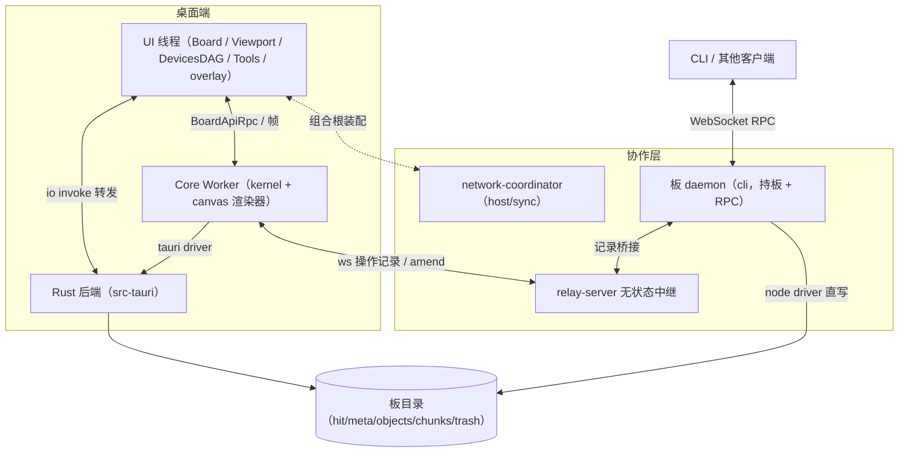

# Hound Whiteboard

基于 Tauri 2 的桌面白板应用，采用 Worker 架构分离核心与 UI。

## 架构概述

本项目专注于白板内核与 Tauri 桌面端：

- **Kernel** — 对象模型、几何、区块、BoardCore 静态图、AOM 动态图、操作日志（hit）、会话存储（store）与 BoardApi 契约；零 canvas/DOM，可运行于 Worker、UI 线程或 Node 环境
- **Renderer 插件** — canvas 渲染器贴附内核同宿运行：脏区渲染、位图合成、对象绘制策略注册表；渲染过程不过桥，RPC 只过操作与帧
- **Host** — 组合根与通道：Core Worker 宿主与 bridges，决定内核与渲染器进程内直连（standalone）还是 RPC 绑定（Worker）；`sync/` 协作同步层（network-coordinator 协调器、relay-server 无状态中继、amend-forwarder 中间帧转发）
- **CLI** — 命令行第二前端：Node 环境经 BoardApi 契约读写板文件，写命令经持板 daemon 执行（与 GUI 实时互见、并发安全）
- **Devices DAG** — 输入设备路由图，将鼠标/键盘/触摸等输入信号路由到对应的工具处理器
- **Tool System** — 创建、选择、修改、擦除等交互工具



UI Kit 另由 [HoundTek/hound-react-ui-kit](https://github.com/HoundTek/hound-react-ui-kit) 独立开发，使用 Cell DSL 构建 UI，为后续 React UI 迁移做准备。

## 项目结构

```
src/
├── kernel/        # 内核包（零 canvas/DOM：对象、几何、区块、BoardCore、AOM、hit、store、BoardApi）
├── renderers/     # 渲染插件（canvas 渲染器、绘制策略注册表）
├── host/          # 组合根与通道（core-worker、bridges/RPC、IO 转发、sync/ 协作同步）
├── io/            # 安全文件操作（core 契约 / driver / adapter / api）
├── cli/           # 命令行第二前端（板 daemon 持板，读写经 BoardApi 契约）
├── ui/            # UI front（Board、Viewport、DevicesDAG、Tools、overlay）
├── docs/          # 架构文档
├── demo/          # 白板 HTML/CSS/JS 入口（桌面与 web 模式）
├── test-support/  # 测试 mock 支撑
├── tests/         # 跨包冒烟 / 集成测试
└── utils/         # 应用级工具（log）
src-tauri/         # Rust 后端（Cargo workspace）
benchmarks/        # 性能基准
scripts/           # CI 检查与 demo 静态服务脚本
```

## 准备工作

确保已安装：

- [Node.js](https://nodejs.org/) ≥ 18
- [Rust](https://rustup.rs/) ≥ 1.70
- [Tauri CLI](https://v2.tauri.app/)（通过 `cargo install tauri-cli` 或随 `yarn` 自动管理）

## 快速开始

```bash
# 安装依赖（完成后自动配置 git hooks）
yarn install

# 启动桌面端应用（开发模式，带热更新）
yarn dev
```

## 协作

开始协作前，需要先启动中继服务器（relay-server）：

```bash
# 启动中继服务器，仅绑定 127.0.0.1
yarn relay
```

```bash
# 启动中继服务器，绑定全部接口
yarn relay --host 0.0.0.0
```

### 浏览器

```bash
yarn demo:web
```

浏览器打开标签页（身份用 URL 参数区分）：

```
http://127.0.0.1:8000/demo/whiteboard.html?relay=ws://127.0.0.1:8377&source=Alice
```

### Tauri 应用窗口

在 Tauri 应用窗口的开发者控制台中执行：

```js
// 设置中继并刷新
hwb.setRelay("ws://127.0.0.1:8377");

// 设置身份并刷新（各设备、各窗口需互不相同）
hwb.setSource("Alice");

// 设置板目录并刷新（同设备多窗口需互不相同）
hwb.setBoard("~/hound-whiteboard/demo-board");

// 查看当前同步配置
hwb.status();

// 清除配置，回到离线
hwb.off();
```

## 命令参考

### 开发

| 命令               | 说明                       |
| ------------------ | -------------------------- |
| `yarn dev`         | Tauri 开发模式（带热更新） |
| `yarn dev:win`     | Windows 开发模式           |
| `yarn dev:mac`     | macOS 开发模式             |
| `yarn dev:linux`   | Linux 开发模式             |
| `yarn dev:android` | Android 开发模式           |
| `yarn dev:ios`     | iOS 开发模式               |

### CLI

| 命令                                                | 说明                                   |
| --------------------------------------------------- | -------------------------------------- |
| `yarn cli <命令> [--path <板目录>]`                 | 以 CLI 读写板文件                      |
| `yarn cli daemon start --name <名> --path <板目录>` | 启动板 daemon（持板 + RPC + 可选中继） |

详细命令面与使用说明见 [src/cli/docs/cli-document.md](src/cli/docs/cli-document.md)。

注意：CLI 默认直接对文件读写，不会与 GUI 同步；板目录有活 daemon 时自动改经 daemon 执行，daemon 连中继后与 GUI 实时互见。

### 协作同步

| 命令            | 说明                                                 |
| --------------- | ---------------------------------------------------- |
| `yarn relay`    | 启动同步中继服务器（默认 8377 端口，仅绑 127.0.0.1） |
| `yarn demo:web` | 启动 demo 静态服务（默认 8000 端口）                 |

多端共享同一板目录：各端连上中继后，操作经中继互相广播（新增/修改/删除/擦除/撤销），远程活跃对象不可擦除，迟到端自动全量补齐。

### 测试与 CI

| 命令                 | 说明                                        |
| -------------------- | ------------------------------------------- |
| `yarn test`          | 运行全部测试                                |
| `yarn ci-check`      | 运行文档链接检查 + `@module` 路径一致性检查 |
| `yarn check:docs`    | 检查文档内部链接是否有效                    |
| `yarn check:modules` | 检查文件头 `@module` 路径与实际目录是否一致 |
| `yarn bench`         | 运行全部性能基准                            |

CI 流水线定义见 `.github/workflows/ci.yml`，推送到 `master` / `develop` 或向 `master` 提 PR 时自动运行。

### 构建

| 命令                       | 说明                                    |
| -------------------------- | --------------------------------------- |
| `yarn build`               | 通用生产构建                            |
| `yarn build:quick`         | 仅构建（跳过依赖安装和图标生成）        |
| `yarn build:mac`           | macOS 构建（dmg + app）                 |
| `yarn build:mac-universal` | macOS 通用构建（Intel + Apple Silicon） |
| `yarn build:win`           | Windows 构建（nsis + msi）              |
| `yarn build:linux`         | Linux 构建（deb + appimage + rpm）      |
| `yarn build:android`       | Android 构建（APK）                     |
| `yarn build:ios`           | iOS 构建                                |

### 发布

| 命令                | 说明                    |
| ------------------- | ----------------------- |
| `yarn ship`         | 运行测试 + 桌面端构建   |
| `yarn ship:win`     | 运行测试 + Windows 构建 |
| `yarn ship:mac`     | 运行测试 + macOS 构建   |
| `yarn ship:linux`   | 运行测试 + Linux 构建   |
| `yarn ship:android` | 运行测试 + Android 构建 |
| `yarn ship:ios`     | 运行测试 + iOS 构建     |

### 图标管理

各平台支持独立的图标源文件，构建时自动使用对应平台的图标：

| 命令                | 源文件                                             | 说明                  |
| ------------------- | -------------------------------------------------- | --------------------- |
| `yarn icon`         | 所有平台                                           | 生成所有平台图标      |
| `yarn icon:desktop` | `icon-desktop.png` → `icon.png`                    | 生成通用桌面图标      |
| `yarn icon:mac`     | `icon-mac.png` → `icon-desktop.png` → `icon.png`   | 生成 macOS 专属图标   |
| `yarn icon:win`     | `icon-win.png` → `icon-desktop.png` → `icon.png`   | 生成 Windows 专属图标 |
| `yarn icon:linux`   | `icon-linux.png` → `icon-desktop.png` → `icon.png` | 生成 Linux 专属图标   |
| `yarn icon:android` | `icon-android.png` → `icon.png`                    | 生成 Android 图标     |
| `yarn icon:ios`     | `icon-ios.png` → `icon.png`                        | 生成 iOS 图标         |

### 移动端

| 命令                 | 说明                |
| -------------------- | ------------------- |
| `yarn init:android`  | 初始化 Android 项目 |
| `yarn dev:android`   | Android 开发模式    |
| `yarn build:android` | Android 构建        |
| `yarn init:ios`      | 初始化 iOS 项目     |
| `yarn dev:ios`       | iOS 开发模式        |
| `yarn build:ios`     | iOS 构建            |

### 清理

| 命令                | 说明                                            |
| ------------------- | ----------------------------------------------- |
| `yarn clean`        | 清理所有构建产物（target + gen + icons + temp） |
| `yarn clean:target` | 清理 Rust 构建产物                              |
| `yarn clean:gen`    | 清理移动端生成文件                              |
| `yarn clean:icons`  | 清理桌面端图标                                  |
| `yarn clean:temp`   | 清理临时目录                                    |
| `yarn clean:status` | 查看当前图标来源                                |
| `yarn clean:help`   | 显示清理命令帮助                                |

## 图标配置

构建系统已迁至 `hound-tauri-build` npm 包，图标配置文件位于 `node_modules/hound-tauri-build/icon-config.json`，可自定义各平台的源文件和输出目录。

### 图标源文件优先级

每个平台按优先级查找图标源文件：

| 平台    | 优先级                                             |
| ------- | -------------------------------------------------- |
| macOS   | `icon-mac.png` > `icon-desktop.png` > `icon.png`   |
| Windows | `icon-win.png` > `icon-desktop.png` > `icon.png`   |
| Linux   | `icon-linux.png` > `icon-desktop.png` > `icon.png` |
| Android | `icon-android.png` > `icon.png`                    |
| iOS     | `icon-ios.png` > `icon.png`                        |

## 文档

- 核心架构文档（[src/docs/](src/docs/)）：[架构总览](src/docs/core-overview.md)、[核心模块](src/docs/core-modules.md)、[数据模型](src/docs/core-data-model.md)、[输入流](src/docs/core-input-flow.md)、[输入编码](src/docs/core-input-encoding.md)、[运行时边界](src/docs/core-runtime-boundaries.md)、[稳定接口](src/docs/core-stable-interfaces.md)、[文件结构](src/docs/file-structure.md)
- 协作同步：[src/host/sync/docs/sync-document.md](src/host/sync/docs/sync-document.md)
- CLI：[src/cli/docs/cli-document.md](src/cli/docs/cli-document.md)
- 模块文档：各核心模块的 `docs/` 目录下有 `*-document.md`（如 `src/kernel/board/docs/`、`src/ui/devices-dag/docs/`）

## 许可

- 项目整体遵循 **GPL-3.0-only**（见 [LICENSE](LICENSE)）
- `src/kernel/` 以 **MIT** 发布（见 [src/kernel/LICENSE](src/kernel/LICENSE)）；对 kernel 的贡献默认按 MIT 接收
