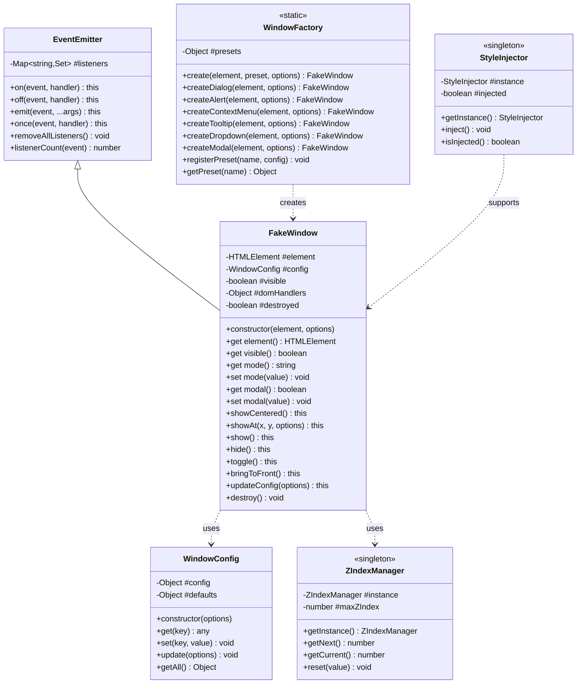

# 伪窗口工具模块 (FakeWindow)

一个基于严格面向对象设计的轻量级窗口管理系统，支持居中显示和自定义位置两种模式。

## 🎯 特性

### 核心架构
- ✅ **完整的 OOP 设计**：采用 ES6+ Class 语法，严格遵循 SOLID 原则
- ✅ **私有字段封装**：使用 `#` 私有字段保护内部状态
- ✅ **Getter/Setter**：完整的属性访问控制
- ✅ **事件系统**：基于观察者模式的完整事件发布订阅机制
- ✅ **工厂模式**：便捷的窗口创建和预设配置
- ✅ **策略模式**：可插拔的定位策略
- ✅ **单例模式**：全局样式和 Z-Index 管理
- ✅ **链式调用**：流畅的 API 设计
- ✅ **生命周期钩子**：完整的 beforeShow/show/beforeHide/hide 事件
- ✅ **完整的 JSDoc**：详细的类型注释和文档

### 设计模式应用

| 模式 | 应用场景 | 类/组件 |
|------|---------|---------|
| **观察者模式** | 事件系统 | [`EventEmitter`](../../src/utils/ui/fake-window.js:95) |
| **工厂模式** | 窗口创建 | [`WindowFactory`](../../src/utils/ui/fake-window.js:1145) |
| **策略模式** | 定位策略 | 象限定位算法 |
| **单例模式** | 全局管理 | [`StyleInjector`](../../src/utils/ui/fake-window.js:68), [`ZIndexManager`](../../src/utils/ui/fake-window.js:234) |

## 📐 类架构设计

### 类层次结构

```
EventEmitter (事件基类)
    ↓
FakeWindow (主窗口类)

WindowFactory (工厂类 - 静态方法)

辅助类：
├── StyleInjector (样式注入器 - 单例)
├── ZIndexManager (Z-Index 管理器 - 单例)
└── WindowConfig (配置管理类)
```

### 类图



## 🚀 快速开始

### 1. 引入模块

```javascript
const FakeWindow = require('./utils/ui/fake-window');
// 或者
const { FakeWindow, WindowFactory } = require('./utils/ui/fake-window');
```

### 2. 基础用法

#### 方式一：使用构造函数

```javascript
// 创建窗口实例
const window = new FakeWindow(document.getElementById('my-window'), {
  mode: 'centered',
  modal: true,
  backdropClose: true
});

// 显示窗口
window.show();

// 隐藏窗口
window.hide();
```

#### 方式二：使用工厂模式

```javascript
// 使用工厂方法创建预设窗口
const dialog = WindowFactory.createDialog(element);
const menu = WindowFactory.createContextMenu(element);
const tooltip = WindowFactory.createTooltip(element);

// 显示
dialog.show();
menu.showAt(100, 200);
```

### 3. 事件监听

```javascript
// 注册事件监听器
window
  .on('show', (element) => {
    console.log('窗口已显示', element);
  })
  .on('hide', (element) => {
    console.log('窗口已隐藏', element);
  });

// 生命周期钩子
window
  .on('beforeShow', () => console.log('即将显示'))
  .on('beforeHide', () => console.log('即将隐藏'));
```

### 4. 链式调用

```javascript
window
  .updateConfig({ modal: false })
  .show()
  .bringToFront();
```

## 📚 核心类 API 文档

### EventEmitter (事件基类)

所有窗口实例都继承自 [`EventEmitter`](../../src/utils/ui/fake-window.js:95)，提供完整的事件系统。

#### 方法

##### `on(event, handler)`

注册事件监听器。

**参数：**
- `event` (string) - 事件名称
- `handler` (Function) - 事件处理函数

**返回：** `this` - 支持链式调用

**示例：**
```javascript
window.on('show', (element) => {
  console.log('窗口显示', element);
});
```

##### `off(event, [handler])`

移除事件监听器。

**参数：**
- `event` (string) - 事件名称
- `handler` (Function, 可选) - 要移除的处理函数，不传则移除该事件的所有监听器

**返回：** `this`

**示例：**
```javascript
window.off('show', handler);  // 移除特定处理器
window.off('show');           // 移除所有 show 事件监听器
```

##### `emit(event, ...args)`

触发事件（内部使用）。

##### `once(event, handler)`

注册一次性事件监听器。

**示例：**
```javascript
window.once('show', () => {
  console.log('只触发一次');
});
```

##### `listenerCount([event])`

获取监听器数量。

**返回：** `number`

---

### FakeWindow (主窗口类)

主窗口类，继承自 [`EventEmitter`](../../src/utils/ui/fake-window.js:95)。

#### 构造函数

```javascript
new FakeWindow(element, options)
```

**参数：**
- `element` (HTMLElement) - 窗口元素
- `options` (Object) - 配置选项

**配置选项：**

| 参数 | 类型 | 默认值 | 说明 |
|------|------|--------|------|
| `mode` | string | `'centered'` | 显示模式：`'centered'` 或 `'positioned'` |
| `modal` | boolean | `true` | 是否为模态窗口 |
| `backdropClose` | boolean | `true` | 点击背景/外部是否关闭 |
| `quadrantMode` | boolean | `false` | 是否启用象限模式（仅 positioned） |
| `primaryQuadrant` | number | `4` | 主象限 (1-4) |
| `minMargin` | number | `10` | 最小边距（像素） |
| `zIndex` | number | `null` | 自定义 z-index |

**示例：**
```javascript
const window = new FakeWindow(element, {
  mode: 'centered',
  modal: true,
  backdropClose: true
});
```

#### 属性 (Getter/Setter)

##### `element` (只读)

获取窗口元素。

**类型：** `HTMLElement`

```javascript
const el = window.element;
```

##### `visible` (只读)

获取可见状态。

**类型：** `boolean`

```javascript
if (window.visible) {
  console.log('窗口正在显示');
}
```

##### `mode`

获取或设置显示模式。

**类型：** `string` (`'centered'` | `'positioned'`)

```javascript
window.mode = 'centered';
console.log(window.mode);
```

##### `modal`

获取或设置模态状态。

**类型：** `boolean`

```javascript
window.modal = true;
```

##### `config` (只读)

获取配置对象的只读副本。

**类型：** `Object`

```javascript
const config = window.config;
console.log(config.mode, config.modal);
```

##### `destroyed` (只读)

检查窗口是否已销毁。

**类型：** `boolean`

```javascript
if (window.destroyed) {
  console.log('窗口已销毁');
}
```

#### 方法

##### `showCentered()`

在视口中央显示窗口。

**返回：** `this`

**触发事件：** `beforeShow`, `show`

**示例：**
```javascript
window.showCentered();
```

##### `showAt(x, y, [options])`

在指定位置显示窗口。

**参数：**
- `x` (number) - X 坐标
- `y` (number) - Y 坐标
- `options` (Object, 可选) - 临时配置覆盖

**返回：** `this`

**触发事件：** `beforeShow`, `show`

**示例：**
```javascript
// 基础用法
window.showAt(100, 200);

// 使用象限模式
window.showAt(e.clientX, e.clientY, {
  quadrantMode: true,
  primaryQuadrant: 4
});
```

##### `show()`

显示窗口（使用当前配置）。

**返回：** `this`

**触发事件：** `beforeShow`, `show`

**示例：**
```javascript
window.show();
```

##### `hide()`

隐藏窗口。

**返回：** `this`

**触发事件：** `beforeHide`, `hide`

**示例：**
```javascript
window.hide();
```

##### `toggle()`

切换显示/隐藏状态。

**返回：** `this`

**示例：**
```javascript
window.toggle();
```

##### `bringToFront()`

将窗口置于最前。

**返回：** `this`

**示例：**
```javascript
window.bringToFront();
```

##### `updateConfig(options)`

更新窗口配置。

**参数：**
- `options` (Object) - 新的配置选项

**返回：** `this`

**示例：**
```javascript
window.updateConfig({
  modal: false,
  backdropClose: true
});
```

##### `destroy()`

销毁窗口，清理所有资源。

**返回：** `void`

**示例：**
```javascript
window.destroy();
```

#### 事件

| 事件名 | 参数 | 说明 |
|--------|------|------|
| `beforeShow` | `(element)` | 显示前触发 |
| `show` | `(element)` | 显示后触发 |
| `beforeHide` | `(element)` | 隐藏前触发 |
| `hide` | `(element)` | 隐藏后触发 |

---

### WindowFactory (工厂类)

窗口工厂类，提供便捷的创建方法。

#### 静态方法

##### `create(element, preset, [options])`

使用预设创建窗口。

**参数：**
- `element` (HTMLElement) - 窗口元素
- `preset` (string) - 预设名称
- `options` (Object, 可选) - 额外配置

**返回：** [`FakeWindow`](../../src/utils/ui/fake-window.js:335)

**预设列表：**
- `dialog` - 对话框
- `alert` - 提示框
- `contextMenu` - 右键菜单
- `tooltip` - 工具提示
- `dropdown` - 下拉菜单
- `modal` - 模态窗口

**示例：**
```javascript
const window = WindowFactory.create(element, 'dialog', {
  backdropClose: true
});
```

##### `createDialog(element, [options])`

创建对话框窗口。

**预设配置：**
```javascript
{
  mode: 'centered',
  modal: true,
  backdropClose: false
}
```

**示例：**
```javascript
const dialog = WindowFactory.createDialog(element);
dialog.show();
```

##### `createAlert(element, [options])`

创建提示框窗口。

**预设配置：**
```javascript
{
  mode: 'centered',
  modal: true,
  backdropClose: true
}
```

##### `createContextMenu(element, [options])`

创建右键菜单窗口。

**预设配置：**
```javascript
{
  mode: 'positioned',
  modal: false,
  backdropClose: true,
  quadrantMode: true,
  primaryQuadrant: 4,
  minMargin: 10
}
```

**示例：**
```javascript
const menu = WindowFactory.createContextMenu(element);

document.addEventListener('contextmenu', (e) => {
  e.preventDefault();
  menu.showAt(e.clientX, e.clientY);
});
```

##### `createTooltip(element, [options])`

创建工具提示窗口。

**预设配置：**
```javascript
{
  mode: 'positioned',
  modal: false,
  backdropClose: false,
  quadrantMode: true,
  primaryQuadrant: 1,
  minMargin: 8
}
```

##### `createDropdown(element, [options])`

创建下拉菜单窗口。

**预设配置：**
```javascript
{
  mode: 'positioned',
  modal: false,
  backdropClose: true,
  quadrantMode: true,
  primaryQuadrant: 4,
  minMargin: 5
}
```

##### `createModal(element, [options])`

创建模态窗口。

**预设配置：**
```javascript
{
  mode: 'centered',
  modal: true,
  backdropClose: true
}
```

##### `registerPreset(name, config)`

注册自定义预设。

**参数：**
- `name` (string) - 预设名称
- `config` (Object) - 预设配置

**示例：**
```javascript
WindowFactory.registerPreset('myPreset', {
  mode: 'centered',
  modal: true,
  backdropClose: false
});

const window = WindowFactory.create(element, 'myPreset');
```

##### `getPreset(name)`

获取预设配置。

**返回：** `Object | null`

##### `getPresetNames()`

获取所有预设名称。

**返回：** `string[]`

## 💡 使用示例

### 1. 居中模态对话框

```javascript
// 使用工厂模式创建
const dialog = WindowFactory.createDialog(
  document.getElementById('confirm-dialog')
);

// 添加事件监听
dialog.on('show', () => {
  console.log('对话框已显示');
});

// 显示对话框
function showConfirm() {
  dialog.showCentered();
}

// 隐藏对话框
function hideConfirm() {
  dialog.hide();
}
```

### 2. 右键上下文菜单

```javascript
// 创建右键菜单
const contextMenu = WindowFactory.createContextMenu(
  document.getElementById('context-menu')
);

// 监听右键事件
document.addEventListener('contextmenu', (e) => {
  e.preventDefault();
  
  // 在鼠标位置显示菜单（自动象限定位）
  contextMenu.showAt(e.clientX, e.clientY);
});

// 菜单项点击后隐藏
function handleMenuClick(action) {
  console.log('菜单操作:', action);
  contextMenu.hide();
}
```

### 3. 图片预览窗口

```javascript
// 创建预览窗口
const preview = new FakeWindow(
  document.getElementById('image-preview'),
  {
    mode: 'centered',
    modal: true,
    backdropClose: true
  }
);

// 显示图片预览
function previewImage(imageSrc) {
  const img = document.querySelector('#image-preview img');
  img.src = imageSrc;
  preview.show();
}
```

### 4. 表单编辑器

```javascript
// 创建表单窗口
const formWindow = WindowFactory.createDialog(
  document.getElementById('form-dialog')
);

// 显示时聚焦第一个输入框
formWindow.on('show', () => {
  document.getElementById('form-name').focus();
});

// 显示表单
function showForm(data) {
  // 填充数据
  document.getElementById('form-name').value = data.name;
  document.getElementById('form-email').value = data.email;
  
  // 显示窗口
  formWindow.show();
}

// 保存表单
function saveForm() {
  const data = {
    name: document.getElementById('form-name').value,
    email: document.getElementById('form-email').value
  };
  
  console.log('保存数据:', data);
  formWindow.hide();
}
```

### 5. 加载提示

```javascript
// 创建加载窗口
const loading = new FakeWindow(
  document.getElementById('loading'),
  {
    mode: 'centered',
    modal: true,
    backdropClose: false  // 不允许点击关闭
  }
);

// 显示加载
async function loadData() {
  loading.show();
  
  try {
    await fetchData();
    loading.hide();
  } catch (error) {
    loading.hide();
    showError(error.message);
  }
}
```

### 6. 自定义扩展

```javascript
// 继承 FakeWindow 创建自定义窗口类
class CustomWindow extends FakeWindow {
  constructor(element, options) {
    super(element, options);
    
    // 添加自定义初始化
    this.initCustomFeatures();
  }
  
  initCustomFeatures() {
    // 自定义功能初始化
    this.on('show', () => {
      this.startAnimation();
    });
  }
  
  // 重写方法
  show() {
    console.log('自定义显示逻辑');
    return super.show();
  }
  
  // 添加新方法
  startAnimation() {
    // 自定义动画
  }
  
  customMethod() {
    // 自定义方法
  }
}

// 使用自定义类
const customWindow = new CustomWindow(element, {
  mode: 'centered'
});
```

## 🎯 象限模式详解

象限模式是智能定位系统，根据可用空间自动选择最佳显示位置。

### 工作原理

以指定坐标为原点，将视口划分为四个象限：

```
┌─────────────────┐
│  II  │  I       │  象限编号：
│──────●──────────│  1 = 右上
│      │          │  2 = 左上
│ III  │  IV      │  3 = 左下
└─────────────────┘  4 = 右下
```

### 切换逻辑

以主象限 4（右下）为例：

| 右边空间 | 下边空间 | 显示象限 |
|---------|---------|---------|
| ✅ | ✅ | IV（右下） |
| ❌ | ✅ | III（左下） |
| ✅ | ❌ | I（右上） |
| ❌ | ❌ | II（左上） |

### 使用示例

```javascript
// 创建支持象限模式的菜单
const menu = new FakeWindow(element, {
  mode: 'positioned',
  quadrantMode: true,
  primaryQuadrant: 4,  // 优先右下
  minMargin: 10
});

// 显示菜单
menu.showAt(e.clientX, e.clientY);
```

### 四种主象限的应用场景

| 主象限 | 适用场景 | 示例 |
|--------|---------|------|
| 1（右上） | 元素下方的提示 | 输入框验证提示 |
| 2（左上） | 右侧元素的菜单 | 侧边栏按钮菜单 |
| 3（左下） | 右上角的下拉菜单 | 用户头像菜单 |
| 4（右下） | 右键菜单、常规下拉 | 上下文菜单 |

## 🔧 高级用法

### 1. 事件系统

```javascript
const window = new FakeWindow(element);

// 注册多个事件
window
  .on('beforeShow', () => console.log('准备显示'))
  .on('show', () => console.log('已显示'))
  .on('beforeHide', () => console.log('准备隐藏'))
  .on('hide', () => console.log('已隐藏'));

// 一次性事件
window.once('show', () => {
  console.log('只触发一次');
});

// 移除事件
const handler = () => console.log('显示');
window.on('show', handler);
window.off('show', handler);

// 移除所有事件
window.off('show');
```

### 2. 配置管理

```javascript
const window = new FakeWindow(element, {
  mode: 'centered',
  modal: true
});

// 使用 setter 更新单个配置
window.modal = false;
window.mode = 'positioned';

// 批量更新配置
window.updateConfig({
  modal: true,
  backdropClose: false
});

// 获取配置
console.log(window.config);
console.log(window.modal);
```

### 3. 链式调用

```javascript
window
  .updateConfig({ modal: false })
  .show()
  .bringToFront();

// 或
window
  .on('show', handler)
  .on('hide', handler)
  .showCentered();
```

### 4. 多窗口管理

```javascript
const windows = {
  dialog: WindowFactory.createDialog(element1),
  menu: WindowFactory.createContextMenu(element2),
  tooltip: WindowFactory.createTooltip(element3)
};

// 显示多个窗口
windows.dialog.show();
windows.menu.showAt(100, 200);

// 关闭所有窗口
Object.values(windows).forEach(w => w.hide());

// 将特定窗口置顶
windows.dialog.bringToFront();
```

### 5. 生命周期管理

```javascript
const window = new FakeWindow(element);

// 初始化时的设置
window.on('beforeShow', () => {
  // 准备数据
  loadData();
});

window.on('show', () => {
  // 启动动画
  startAnimation();
});

window.on('beforeHide', () => {
  // 保存状态
  saveState();
});

window.on('hide', () => {
  // 清理资源
  cleanup();
});

// 销毁窗口
window.destroy();
```

### 6. 自定义预设

```javascript
// 注册自定义预设
WindowFactory.registerPreset('notification', {
  mode: 'positioned',
  modal: false,
  backdropClose: true,
  quadrantMode: true,
  primaryQuadrant: 1
});

// 使用自定义预设
const notification = WindowFactory.create(element, 'notification');
notification.showAt(window.innerWidth - 20, 20);
```

## 🎨 样式自定义

### 自动注入的样式

模块自动注入以下基础样式（外层容器）：

```css
.fake-window-wrapper {
  position: fixed;
  top: 0;
  left: 0;
  width: 100%;
  height: 100%;
  z-index: 10000;
  display: none;
  pointer-events: none;
}

.fake-window-wrapper.show {
  display: block;
}

.fake-window-wrapper.modal {
  pointer-events: auto;
}

.fake-window-wrapper.centered {
  display: flex;
  align-items: center;
  justify-content: center;
}

.fake-window-wrapper.positioned > * {
  position: fixed;
}
```

### 用户自定义样式

窗口内容的所有样式由用户完全控制：

```css
/* 背景遮罩 */
.fake-window-wrapper.modal::before {
  content: '';
  position: absolute;
  top: 0;
  left: 0;
  width: 100%;
  height: 100%;
  background: rgba(0, 0, 0, 0.5);
  backdrop-filter: blur(4px);
}

/* 窗口内容 */
.dialog-box {
  position: relative;
  z-index: 1;
  background: white;
  border-radius: 12px;
  padding: 24px;
  box-shadow: 0 8px 32px rgba(0, 0, 0, 0.4);
}

/* 动画 */
.fake-window-wrapper.show .dialog-box {
  animation: slideUp 0.3s ease;
}

@keyframes slideUp {
  from {
    opacity: 0;
    transform: translateY(20px);
  }
  to {
    opacity: 1;
    transform: translateY(0);
  }
}
```

## 📋 SOLID 原则应用

### 单一职责原则 (SRP)

每个类专注于单一职责：

- [`EventEmitter`](../../src/utils/ui/fake-window.js:95)：事件管理
- [`FakeWindow`](../../src/utils/ui/fake-window.js:335)：窗口显示和交互
- [`WindowFactory`](../../src/utils/ui/fake-window.js:1145)：窗口创建
- [`StyleInjector`](../../src/utils/ui/fake-window.js:68)：样式注入
- [`ZIndexManager`](../../src/utils/ui/fake-window.js:234)：层级管理
- [`WindowConfig`](../../src/utils/ui/fake-window.js:271)：配置管理

### 开闭原则 (OCP)

通过继承和组合扩展功能，无需修改现有代码：

```javascript
// 扩展新功能
class AnimatedWindow extends FakeWindow {
  show() {
    this.playAnimation();
    return super.show();
  }
  
  playAnimation() {
    // 自定义动画
  }
}
```

### 里氏替换原则 (LSP)

子类可以替换父类使用：

```javascript
class CustomWindow extends FakeWindow {
  // 可以在任何使用 FakeWindow 的地方使用 CustomWindow
}

const window = new CustomWindow(element);
window.show();  // 正常工作
```

### 接口隔离原则 (ISP)

提供精简的公共接口，隐藏内部实现：

```javascript
// 公共接口
window.show();
window.hide();
window.toggle();

// 私有实现（使用 # 私有字段）
#applyDisplay();
#setupEventListeners();
```

### 依赖倒置原则 (DIP)

依赖抽象（事件系统）而非具体实现：

```javascript
// 通过事件系统解耦
window.on('show', handler);  // 不依赖具体实现
```

## 🌐 浏览器兼容性

- Chrome 60+
- Firefox 55+
- Safari 12+
- Edge 79+
- Opera 47+

**注意：** 需要支持 ES6+ 特性（Class、私有字段、箭头函数等）

## 📚 更多资源

- [快速开始指南](./QUICK-START-fake-window.md)
- [完整示例](./fake-window-standalone.html)
- [源代码](../../src/utils/ui/fake-window.js)

## 📄 许可证

MIT License