# 时间回溯树内核情景推演

本文是 [undo-tree-kernel-document.md](./undo-tree-kernel-document.md) 的示例部分，以具体情景模拟内核设计在多用户、弱网下的行为，验证收敛性与语义正确性。

## 图例

- 根节点用圆圈表示，圆内的文字表示该树是以该方视角来看的。
- HEAD 指针以圆角边框表示。
- 节点标注形如 `A1(t0, A)`，表示 `{所属操作}({时刻}, {author})`。
- 「原位置」节点：跨节点撤消改挂后留在原处的节点，与新位置的节点凭同一 share id 共享数据。注意：只共享数据，但节点 id 和其父子都不尽相同。

## 规则约定

- **操作为王**：操作是一等记录（id、author、时间、内容），可产生多个节点；树由操作的结构效果按 (时间, author) 序构建，是日志的追溯结构。
- **节点不持有数据**：数据放在数据池中凭 share id 获取；多个节点可凭同一 share id 共享数据。
- HEAD 指向当前状态对应的节点，可在链中间（其下游后代是已撤销的节点，可重做）；随操作应用自然移动，由日志派生、不参与仲裁。
- **撤销与重做（统一语义）**：撤销记录目标节点，应用时按目标在活动链上的位置呈现两种形态——目标为末端时退化为 HEAD 回退，目标在链中间时分叉改挂；重做把 HEAD 移到撤销记录的原 HEAD 位置。各情景表述中的「跨节点撤消」即撤销的一般形态（目标在链中间），「非跨节点撤消」即退化形态（目标为末端）。
- 操作的应用分两部分：结构变更（增删节点、改挂）无条件应用；HEAD 移动条件应用——仅当评估时 HEAD 恰为该操作的起点时才移动指针。
- **插入规则**：到达的增加节点按 (时间, author) 插入活动链的对应位置，插入点之后的节点改挂；节点记录的父节点是创建时的本地视图，建树以时间序为准。插入规则是「所有用户一致」原则的必然推论：单一用户顺序操作不会产生延迟分叉，多用户的树必须与之一致。
- 状态 = 从根到 HEAD 按节点序回放。
- 各情景「设定」表的结构效果列描述该操作按日志序应用时对树的效果。
- **回放是真相**：旧操作插入改变了上下文敏感操作（如撤销）的应用环境时，受影响的后缀按日志序重放重估；增量应用是缓存，必须与回放同构（情景四）。

## 情景一：跨节点撤消与并发新增

### 设定

A、B 两人协作，t=0 ~ t=3 网络良好瞬时同步，t=4 起网络不好，t=6 恢复：

| 时刻 | author | 操作 | 类型           | 事件                               | 结构效果                                      | 同步到对方的时刻 |
| ---- | ------ | ---- | -------------- | ---------------------------------- | --------------------------------------------- | ---------------- |
| t=0  | A      | A1   | 增加对象       | 新增 A1（父 root）                 | 追加到 root 后                                | 即时             |
| t=1  | B      | B1   | 增加对象       | 新增 B1（父 A1）                   | 追加到 A1 后                                  | 即时             |
| t=2  | A      | A2   | 增加对象       | 新增 A2（父 B1）                   | 追加到 B1 后                                  | 即时             |
| t=3  | B      | B2   | 增加对象       | 新增 B2（父 A2）                   | 追加到 A2 后                                  | 即时             |
| t=4  | A      | O1   | 撤销（超分子） | 撤销 A2（A2 在链中间，呈一般形态） | B1 处分叉，B2 改挂到 B1 下；原位置截断保留 B2 | t=6              |
| t=5  | B      | O2   | 增加对象       | 新增 B3（父 B2）                   | 追加到 B2 后                                  | t=6              |
| t=6  | —      | —    | —              | 网络恢复，O1 到 B、O2 到 A         | —                                             | —                |

### t=0 ~ t=3：交替新增

四个增加对象操作瞬时同步。每收到一个操作，两端执行相同的建树动作：把操作产生的节点挂到活动链末端。日志与树同步生长：


两端状态：A1、B1、A2、B2。

### t=4：A 执行跨节点撤消（O1）

操作描述：O1 是超分子操作（t=4, A），目标是 A2（非 HEAD 所指）。含两个分子：

- 复制挂接：在 A2 的父节点 B1 处分叉——B2 的节点（连同身份与子树）改挂到 B1 下；A2 原位置留下一个节点，与改挂后的节点凭同一 share id 共享数据。
- 更改 HEAD：起点 B2（原位置），终点 B2（新位置）。移动指针类分子，不产生节点，仅是日志条目。

O1 给树加的内容（A 端视角）：


A 端活动链：A1 → B1 → B2，HEAD = 末端 B2。状态：A1、B1、B2（无 A2）。网络不好，O1 未同步到 B。

### t=5：B 新增 B3（O2）

操作描述：O2 是增加对象操作（t=5, B），产生节点 B3，挂到本地活动链末端 B2 下（B 端视角）：

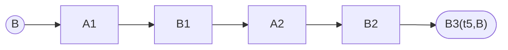

B 端状态：A1、B1、A2、B2、B3。网络不好，O2 未同步到 A。

### t=6：网络恢复，互相同步

#### B 端：同步到旧操作 O1（t=4，早于本地 O2）

O1 是旧操作，时刻早于本地已有的 O2。建树过程分四步：

1. **插入日志**：按 (时间, author) 把 O1 插入日志，位于 B2 与 B3 之间。
2. **应用结构效果**：O1 的复制挂接要在 B1 处分叉——B2 的节点（连同整个子树，含 B3）改挂到 B1 下。原位置的保留按 (时间, author) 截断：不晚于 O1(t=4) 的节点（B2，t=3）留在 A2 下，与改挂后的节点凭同一 share id 共享数据；晚于 O1 的节点（B3，t=5）不在原位置保留，只存在于撤消分支。B3 随子树进入撤消分支，不需要任何额外处理。
3. **应用 HEAD 效果（条件）**：O1 的 HEAD 分子起点是 B2（原位置）；本地 HEAD 是 B3，不等于起点——指针不动。
4. **结果**：活动链为 A1 → B1 → B2 → B3，HEAD = B3。增量应用与重放结果一致（见下方收敛校验），B 端无需重放整棵树。

#### A 端：同步到新操作 O2（t=5，晚于本地 O1）

1. **插入日志**：O2 追加到日志尾部。
2. **应用结构效果**：B3 的父亲是 B2。A 端 B2 的节点身份在活动链上（t=4 已被 O1 改挂到 B1 下），B3 直接挂到它下面。
3. **应用 HEAD 效果**：新增节点把 HEAD 推进到活动链新末端 B3。

#### 收敛校验（重放路径）

两端日志一致：A1(t0), B1(t1), A2(t2), B2(t3), O1(t4), O2(t5)。从空树按日志序重放结构效果：

1. 追加 A1、B1、A2、B2 → 链 root → A1 → B1 → A2 → B2
2. O1：B2（连同子树，此时为空）改挂到 B1 下，原位置留下共享节点 → 分叉
3. O2：B3 挂到 B2 下（B2 在活动链上）→ 活动链 A1 → B1 → B2 → B3

重放结果与两端增量建树完全相同——树是日志的确定性函数，这是操作级 CRDT 收敛的来源。

两端最终收敛到同一棵树与同一 HEAD：


### 结果

- 收敛性成立：两端日志一致、树结构一致、HEAD 一致（B3）、状态一致，与 O1、O2 的到达顺序无关。
- 语义正确：A2 的效果被撤消，B3 的效果保留。状态 = A1、B1、B2、B3（无 A2）。
- 情景四以全离线合并复现了本结果——同一日志，同一棵树，见情景四。

### 设计要点确认

本情景验证了三条规则的相互配合：

1. **改挂模型是正解**：跨节点撤消后，B3 按父亲 id 到达时，只有 B2 的原节点身份在活动链上，B3 才能正确落位；B 应用 O1 时 B3 随 B2 的子树一并改挂，自动进入撤消分支。改挂是到达节点正确落位的前提，同时省去复制成本，语义与实现统一。
2. **HEAD 是当前状态对应的节点，由日志派生、不参与仲裁**：HEAD 随结构变更自然移动；对 HEAD 移动与新增到达的先后不做时间比较，B3 就不会被「压过」。
3. **HEAD 移动条件应用**：起点不匹配时只应用结构、不动指针，本地已推进的 HEAD（B3）不被远程的旧 HEAD 操作（终点 B2 新位置）拉回去。
4. **原位置的截断规则**：改挂时原位置保留的子树以操作时间为界——不晚于 O1 的留下，晚于 O1 的只去撤消分支。A 执行 O1 时 B3 尚不存在，复制范围天然是 B2；B 在 t=6 应用同一 O1 时虽有 B3 在场，截断规则保证两端结果一致——旧操作的增量应用与按日志重放同构。

## 情景二：新增操作有网络延迟

### 设定

与情景一相同的操作序列，但前四个新增也有延迟：

| 时刻 | author | 操作 | 类型           | 事件                          | 结构效果                                      | 同步到对方的时刻 |
| ---- | ------ | ---- | -------------- | ----------------------------- | --------------------------------------------- | ---------------- |
| t=0  | A      | A1   | 增加对象       | 新增 A1（父 root）            | 追加到 root 后                                | t=2.5            |
| t=1  | B      | B1   | 增加对象       | 新增 B1（父 root，未见过 A1） | 插入 A1 与 A2 之间，A2 改挂到 B1 下           | t=3.5            |
| t=2  | A      | A2   | 增加对象       | 新增 A2（父 A1）              | 追加到 B1 后                                  | t=4.5            |
| t=3  | B      | B2   | 增加对象       | 新增 B2（父 B1）              | 追加到 A2 后                                  | t=3.8            |
| t=4  | A      | O1   | 撤销（超分子） | 撤销 A2                       | B1 处分叉，B2 改挂到 B1 下；原位置截断保留 B2 | t=6              |
| t=5  | B      | O2   | 增加对象       | 新增 B3（父 B2）              | 追加到 B2 后                                  | t=6              |

### t=0 ~ t=4.5：延迟新增的建树

新增到达时，对端的本地 HEAD 已经走过该操作的创建点——按记录的父节点挂接会把树挂岔。插入规则按 (时间, author) 把到达节点插入活动链的对应位置。

A 端建树过程：

1. t=0 新增 A1；t=2 新增 A2 挂到 A1 下。t=2 时 A 端视角：


2. t=3.5 收到 B1（t=1，父 root）：B1 时间介于 A1(t=0) 与 A2(t=2) 之间，插入 A1 与 A2 之间，A2 改挂到 B1 下，HEAD 仍为末端 A2：

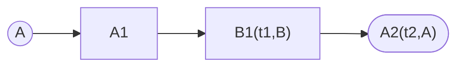

3. t=3.8 收到 B2（t=3，父 B1）：时间晚于 A2(t=2)，追加到末端。

B 端建树过程：

1. t=1 新增 B1（A1 尚未到达）：

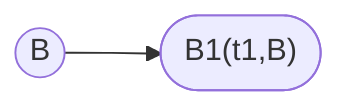

2. t=2.5 收到 A1（t=0）：时间早于 B1(t=1)，插到 B1 之前，B1 改挂到 A1 下：

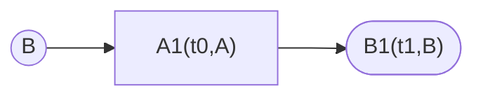

3. t=3 新增 B2：挂到 B1 下。
4. t=4.5 收到 A2（t=2，父 A1）：时间介于 B1(t=1) 与 B2(t=3) 之间，插入 B1 与 B2 之间，B2 改挂到 A2 下。

t=4.5 时两端收敛到同一棵树，与瞬时同步的结果完全相同：

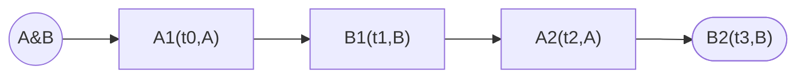

延迟只影响中间过程，不影响最终结构——树由操作集合与时间唯一决定，与到达顺序无关。

### t=4 之后

t=4 的跨节点撤消、t=5 的新增 B3、t=6 的互相同步，建树过程与情景一完全一致（两端在 t=4.5 已收敛到同一棵树），最终收敛到：

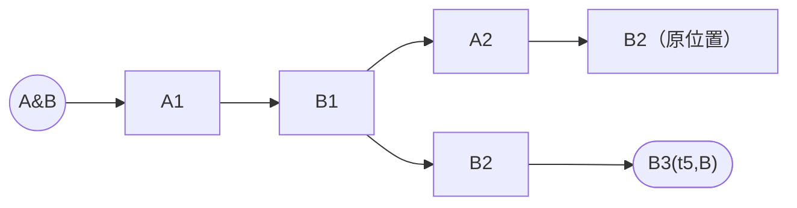

状态 = A1、B1、B2、B3（无 A2），语义正确。

### 设计要点确认

1. **插入规则是「所有用户一致」的必然推论**：单一用户按时间顺序操作产生的树是一条链，多用户的树必须与之一致——延迟造成的分叉违反所用在一，本身就不能保留。到达节点按 (时间, author) 插入活动链后，延迟只改变改挂次数，不改变最终结构。
2. **父节点记录是创建时的本地视图**：B1 记 root、B2 记 B1，建树以时间序为准。
3. **改挂的工程量**：插入引起级联改挂，延迟窗口内可能反复发生；由延迟容忍窗吸收（见[时间回溯树内核文档](undo-tree-kernel-document.md)「延迟容忍窗」）。

### 遗留问题

- 两个纯 HEAD 移动并发的规则：已由情景三覆盖（HEAD 移动按日志序回放评估）。

## 情景三：并发纯 HEAD 移动

### 设定

A、B 两人在已同步的链上（t=0 ~ t=3 同情景一）各自做撤销与重做，网络不好，t=6 才互相同步。初始链：

| 时刻 | author | 操作 | 类型     | 事件               | 结构效果       | 同步到对方的时刻 |
| ---- | ------ | ---- | -------- | ------------------ | -------------- | ---------------- |
| t=0  | A      | A1   | 增加对象 | 新增 A1（父 root） | 追加到 root 后 | 即时             |
| t=1  | B      | B1   | 增加对象 | 新增 B1（父 A1）   | 追加到 A1 后   | 即时             |
| t=2  | A      | A2   | 增加对象 | 新增 A2（父 B1）   | 追加到 B1 后   | 即时             |
| t=3  | B      | B2   | 增加对象 | 新增 B2（父 A2）   | 追加到 A2 后   | 即时             |

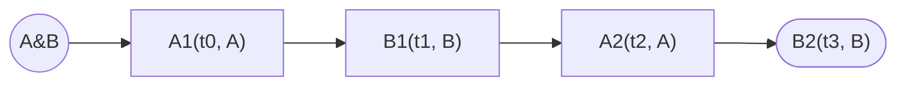

撤销记录目标节点，目标为活动链末端时退化为纯 HEAD 移动（本情景各撤销均呈退化形态，不改动树结构）；重做是纯 HEAD 移动。两者都不产生节点。

### 情形 1：重复撤销同一节点

| 时刻 | author | 操作 | 类型 | 事件     | 结构效果                               | 同步到对方的时刻 |
| ---- | ------ | ---- | ---- | -------- | -------------------------------------- | ---------------- |
| t=4  | A      | O1   | 撤销 | 撤销 B2  | B2 为末端，退化为 HEAD 回退（B2 → A2） | t=6              |
| t=5  | B      | O2   | 撤销 | 撤销 B2  | B2 为末端，退化为 HEAD 回退（B2 → A2） | t=6              |
| t=6  | —      | —    | —    | 互相同步 | —                                      | —                |

两端各自撤销后 HEAD 都在 A2；收到对方的撤销操作时，本地 HEAD 是 A2，不等于起点 B2——跳过。两端 HEAD = A2。同一撤销意图的重复操作被条件应用自然吸收。最终树（两端一致）：

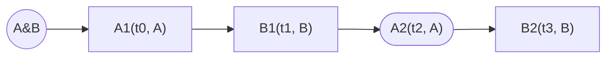

HEAD 位于链中间：B2 是已撤销的后代节点，可经重做找回。

### 情形 2：不同深度的撤销

| 时刻  | author | 操作 | 类型 | 事件     | 结构效果                    | 同步到对方的时刻 |
| ----- | ------ | ---- | ---- | -------- | --------------------------- | ---------------- |
| t=4   | A      | O1   | 撤销 | 撤销 B2  | 退化为 HEAD 回退（B2 → A2） | t=6              |
| t=5   | B      | O2   | 撤销 | 撤销 B2  | 退化为 HEAD 回退（B2 → A2） | t=6              |
| t=5.5 | B      | O3   | 撤销 | 撤销 A2  | 退化为 HEAD 回退（A2 → B1） | t=6              |
| t=6   | —      | —    | —    | 互相同步 | —                           | —                |

- A 收 O2：HEAD 是 A2，不等于起点 B2，跳过；收 O3：HEAD 是 A2，恰为起点，应用，HEAD → B1。
- B 收 O1：HEAD 是 B1，不等于起点 B2，跳过。

两端 HEAD = B1。撤销效果取并集（最深者）——条件应用让连续的撤销级联生效。最终树（两端一致）：

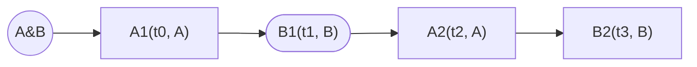

HEAD = B1 位于链中间，A2、B2 是已撤销的后代节点，可经重做找回。

### 情形 3：撤销与重做交错

| 时刻  | author | 操作 | 类型 | 事件                 | 结构效果                    | 同步到对方的时刻 |
| ----- | ------ | ---- | ---- | -------------------- | --------------------------- | ---------------- |
| t=4   | A      | O1   | 撤销 | 撤销 B2              | 退化为 HEAD 回退（B2 → A2） | t=6              |
| t=5   | B      | O2   | 撤销 | 撤销 B2              | 退化为 HEAD 回退（B2 → A2） | t=6              |
| t=5.5 | B      | O3   | 重做 | 重做（HEAD A2 → B2） | 无（纯 HEAD 移动）          | t=6              |
| t=6   | —      | —    | —    | 互相同步             | —                           | —                |

按到达顺序应用会发散：

- A 端顺序：O1（本地）→ O2（跳过）→ O3（A2 恰为起点，应用）→ HEAD = B2。
- B 端顺序：O2、O3（本地）→ O1（收到时 HEAD 是 B2，恰为起点，应用）→ HEAD = A2。

同一组操作、同一条件规则、不同到达顺序，两端 HEAD 不一致。修正规则：**HEAD 移动按日志序回放评估**——每次日志插入后，按 (时间, author) 序重放 HEAD 移动序列（条件应用）重算 HEAD：

日志序 O1(t4) → O2(t5) → O3(t5.5)：B2 → A2 →（跳过）→ B2。两端 HEAD = B2。B 的重做（最晚的意图）生效，A 的撤销被覆盖——时间序决定意图先后，语义确定。最终树（两端一致）：

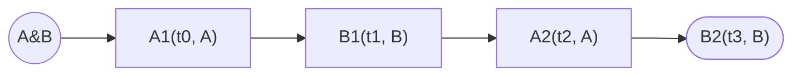

### 情形 4：先撤中间节点，再撤末端

| 时刻 | author | 操作 | 类型 | 事件                              | 结构效果                                                               | 同步到对方的时刻 |
| ---- | ------ | ---- | ---- | --------------------------------- | ---------------------------------------------------------------------- | ---------------- |
| t=4  | A      | O1   | 撤销 | 撤销 A2                           | A2 在链中间，呈一般形态：B1 处分叉，B2 改挂到 B1 下；原位置截断保留 B2 | t=6              |
| t=5  | B      | O2   | 撤销 | 撤销 B2（本地呈退化形态 B2 → A2） | 重放评估时 B2 为撤消分支末端，退化为 HEAD 回退（B2 → B1）              | t=6              |
| t=6  | —      | —    | —    | 互相同步                          | —                                                                      | —                |

按日志序回放：O1(t4) 先应用——A2 在链中间，呈一般形态，B1 处分叉、B2 改挂，活动链变为 A1 → B1 → B2（撤消分支），HEAD = B2；O2(t5) 评估时 B2 是活动链末端，退化为 HEAD 回退，HEAD = B1。

A 端建树过程：

1. t=4 本地应用 O1（撤销 A2）：A2 在链中间，呈一般形态——B1 处分叉，B2 改挂到 B1 下；原位置截断保留 B2（t=3 ≤ t=4）。HEAD 移到撤消分支末端 B2：

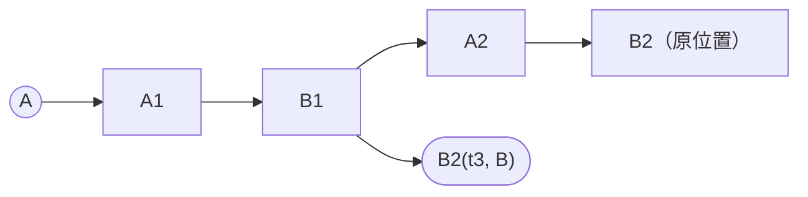

2. t=6 收 O2（t=5，撤销 B2）：日志序最新，纯应用——B2 在活动链（撤消分支）末端，退化为 HEAD 回退，HEAD = B1：

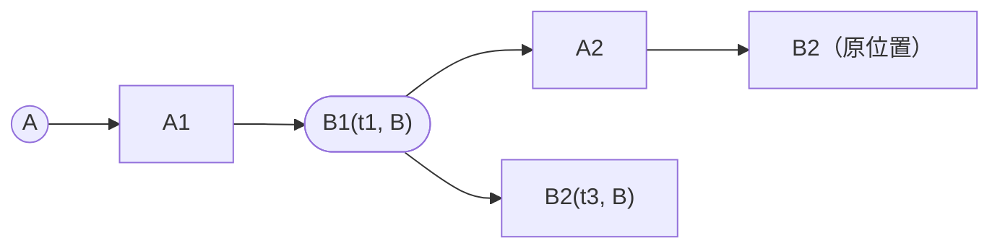

B 端建树过程：

1. t=5 本地应用 O2（撤销 B2）：B2 为末端，退化为 HEAD 回退，HEAD = A2，树结构不变：

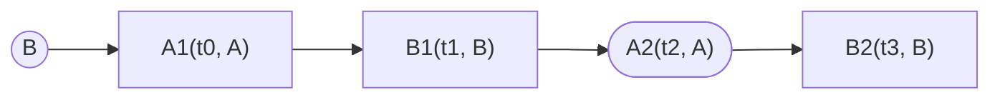

2. t=6 收 O1（t=4，撤销 A2）：插入点之后有已应用的 O2（撤销，上下文敏感）——按「插入与重放的边界」重放受影响后缀。先重放 O1：A2 在链中间，呈一般形态，分叉改挂，HEAD = B2（撤消分支）：


3. 再重放 O2：B2 为撤消分支末端，退化为 HEAD 回退，HEAD = B1。最终树（两端一致）：

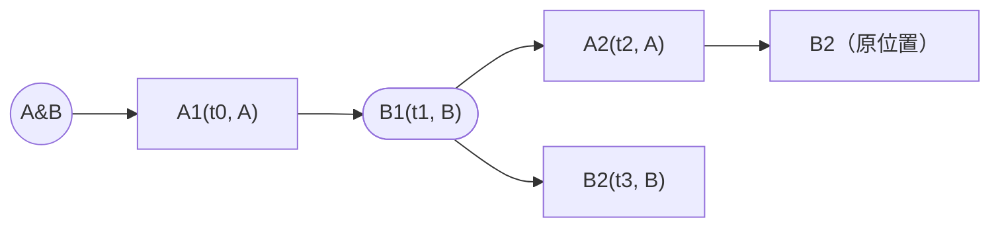

HEAD = B1，状态 = A1、B1。两次撤销都生效：A2 与 B2 的效果都被移除。

### 情形 5：先撤末端，再撤中间节点

| 时刻 | author | 操作 | 类型 | 事件                                            | 结构效果                                                | 同步到对方的时刻 |
| ---- | ------ | ---- | ---- | ----------------------------------------------- | ------------------------------------------------------- | ---------------- |
| t=4  | B      | O1   | 撤销 | 撤销 B2                                         | B2 为末端，退化为 HEAD 回退（B2 → A2）                  | t=6              |
| t=5  | A      | O2   | 撤销 | 撤销 A2（本地呈一般形态分叉；重放时呈退化形态） | 重放评估时 A2 为活动链末端，退化为 HEAD 回退（A2 → B1） | t=6              |
| t=6  | —      | —    | —    | 互相同步                                        | —                                                       | —                |

按日志序回放：O1(t4) 先应用——B2 为末端，退化为 HEAD 回退，HEAD = A2；O2(t5) 评估时 A2 已是活动链末端，同样退化，HEAD = B1。两个撤销都呈退化形态，树保持一条直链。

A 端建树过程：

1. t=5 本地应用 O2（撤销 A2）：A2 在链中间（B2 在其上），呈一般形态——B1 处分叉，B2 改挂到 B1 下；原位置截断保留 B2。HEAD 移到撤消分支末端 B2：


2. t=6 收 O1（t=4，撤销 B2）：插入点之后有已应用的 O2（撤销，上下文敏感）——重放受影响后缀。先重放 O1：B2 为末端，退化为 HEAD 回退（B2 → A2），树结构不变；再重放 O2：A2 已是活动链末端，退化为 HEAD 回退（A2 → B1）。两个撤销都呈退化形态，本地建出的分叉被抚平，树恢复直链，HEAD = B1：

```mermaid
flowchart LR
    R((A)) --> A1 --> B1(["B1(t1, B)"]) --> A2["A2(t2, A)"] --> B2["B2(t3, B)"]
```

B 端建树过程：

1. t=4 本地应用 O1（撤销 B2）：B2 为末端，退化为 HEAD 回退，HEAD = A2：

```mermaid
flowchart LR
    R((B)) --> A1["A1(t0, A)"] --> B1["B1(t1, B)"] --> A2(["A2(t2, A)"]) --> B2["B2(t3, B)"]
```

2. t=6 收 O2（t=5，撤销 A2）：日志序最新，纯应用——A2 是活动链末端，退化为 HEAD 回退，HEAD = B1。最终树（两端一致）：

```mermaid
flowchart LR
    R((A&B)) --> A1["A1(t0, A)"] --> B1(["B1(t1, B)"]) --> A2["A2(t2, A)"] --> B2["B2(t3, B)"]
```

HEAD = B1 位于链中间，状态 = A1、B1。

与情形 4 对照：操作集合相同、日志序不同——情形 4 先撤 A2 长出分叉，情形 5 先撤 B2 保持直链。树由日志序决定；两端各自一致，最终状态相同。

### 设计要点确认

1. **HEAD 不一定是链的末端**：撤销后 HEAD 位于链中间，其下游后代是已撤销节点（可重做），情形 1 的图即为例证。
2. **HEAD 移动按日志序回放评估**：条件应用的评估顺序必须是全局 (时间, author) 序，不能是到达顺序，否则情形 3 发散。HEAD 与树同构——树 = 日志的确定性函数，HEAD = 日志中 HEAD 移动序列的确定性函数。
3. **条件应用的吸收性**：重复与级联的撤销在日志序回放中自然得到正确结果（情形 1、2）。
4. **统一语义下的情形 3**：撤销统一为目标节点语义后，A、B 的撤销都记为「撤销(B2)」——日志序回放中 A 的撤销先生效（B2 为末端，退化为 HEAD 回退），B 的撤销被吸收（B2 已不在活动链上），B 的重做（A2 → B2）按条件应用生效，两端 HEAD = B2，结论与纯 HEAD 移动视角一致。
5. **情形 4、5 对照**：操作集合相同、日志序不同——先撤中间节点再撤末端长出分叉，先撤末端再撤中间节点保持直链。树由日志序决定；两端各自一致，最终状态相同。撤销的形态按评估时目标在活动链上的位置确定，再次印证。

## 情景四：全程离线，最后一次性完全同步

### 设定

A、B 从同一块空板开始，全程无同步，各自离线工作，t=6 一次性完全同步：

| 时刻 | author | 操作 | 类型     | 事件                                            | 结构效果                                      | 同步到对方的时刻 |
| ---- | ------ | ---- | -------- | ----------------------------------------------- | --------------------------------------------- | ---------------- |
| t=0  | A      | A1   | 增加对象 | 新增 A1（父 root）                              | 追加到 root 后                                | t=6              |
| t=1  | B      | B1   | 增加对象 | 新增 B1（父 root）                              | 插入 A1 与 A2 之间，A2 改挂到 B1 下           | t=6              |
| t=2  | A      | A2   | 增加对象 | 新增 A2（父 A1）                                | 追加到 B1 后                                  | t=6              |
| t=3  | B      | B2   | 增加对象 | 新增 B2（父 B1）                                | 追加到 A2 后                                  | t=6              |
| t=4  | A      | U    | 撤销     | 撤销 A2（本地呈退化形态；合并重放时呈一般形态） | B1 处分叉，B2 改挂到 B1 下；原位置截断保留 B2 | t=6              |
| t=5  | B      | B3   | 增加对象 | 新增 B3（父 B2）                                | 追加到 B2 后                                  | t=6              |
| t=6  | —      | —    | —        | 一次性完全同步                                  | —                                             | —                |

### 离线期间各自的视角

A 端：链 A1 → A2。t=4 执行撤销(A2)：A2 是活动链末端，撤销呈现退化形态——HEAD 回退到 A1，A2 留在原地成为已撤销的后代节点：

```mermaid
flowchart LR
    R((A)) --> A1(["A1(t0, A)"]) --> A2["A2(t2, A)"]
```

A 端状态：A1。

B 端：链 B1 → B2 → B3：

```mermaid
flowchart LR
    R((B)) --> B1["B1(t1, B)"] --> B2["B2(t3, B)"] --> B3(["B3(t5, B)"])
```

B 端状态：B1、B2、B3。

### t=6：完全同步的建树过程

1. **合并日志**：六个操作按 (时间, author) 排序：A1(t0)、B1(t1)、A2(t2)、B2(t3)、U(t4)、B3(t5)。两端日志一致。

2. **回放路径（树 = f(日志)）**：四个新增按插入规则建出链 A1 → B1 → A2 → B2（HEAD = B2）；U(t4) 评估时 A2 在链中间（B2 在其上），撤销呈现**一般形态**——B1 处分叉，B2 改挂到 B1 下，原位置按截断规则保留 B2（t=3 ≤ t=4，共享数据），HEAD 移到撤消分支末端 B2：

```mermaid
flowchart LR
    R((A&B)) --> A1 --> B1 --> A2 --> B2o["B2（原位置）"]
    B1 --> B2(["B2(t3, B)"])
```

B3(t5) 的父亲 B2 的节点身份在活动链上（刚被改挂），B3 挂到它下面，HEAD = B3：

```mermaid
flowchart LR
    R((A&B)) --> A1 --> B1 --> A2 --> B2o["B2（原位置）"]
    B1 --> B2 --> B3(["B3(t5, B)"])
```

3. **A 端增量视角**（本地先有 A1、A2、U，HEAD = A1）：
   - 收 B1(t1)：插入点之后有已应用的 U（撤销）——按「插入与重放的边界」触发后缀重放；U 的求值上下文未变（A2 仍无后继，保持退化形态），重放结果与直接插入相同：B1 插入 A1 与 A2 之间，A2 改挂到 B1 下（保持已撤销状态），HEAD 推进到 B1：

```mermaid
flowchart LR
    R((A)) --> A1["A1(t0, A)"] --> B1(["B1(t1, B)"]) --> A2["A2(t2, A)"]
```

- 收 B2(t3)：插入点之后有已应用的 U（撤销，上下文敏感）——重放受影响后缀。B2 先挂到父节点 A2 下（A2 保持已撤销状态）；重放 U：U 的上下文从「A2 为末端」变为「A2 在链中间（B2 在其上）」，形态从退化重估为一般——B1 处分叉，B2 改挂到 B1 下。同时原位置按截断规则保留 B2（t=3 ≤ U 的 t=4）：B2 在 A 执行 U 时已存在于链上，属于撤消前历史的成员，故树上留下两个 B2——原位置一个、撤消分支一个，凭同一 share id 共享数据。HEAD = B2：

```mermaid
flowchart LR
    R((A)) --> A1 --> B1 --> A2 --> B2o["B2（原位置）"]
    B1 --> B2(["B2(t3, B)"])
```

- 收 B3(t5)：追加到撤消分支末端 B2 下，HEAD = B3，与回放路径汇合。

4. **B 端增量视角**（本地先有 B1、B2、B3，HEAD = B3）：
   - 收 A1(t0)：插到 B1 之前，B1 改挂到 A1 下；收 A2(t2)：插入 B1 与 B2 之间，B2 改挂到 A2 下。两次都是纯插入（插入点之后没有上下文敏感操作）：

```mermaid
flowchart LR
    R((B)) --> A1["A1(t0, A)"] --> B1["B1(t1, B)"] --> A2["A2(t2, A)"] --> B2["B2(t3, B)"] --> B3(["B3(t5, B)"])
```

- 收 U(t4)：日志序最新，纯应用——A2 在链中间，呈一般形态：B1 处分叉，B2 → B3 的链改挂到 B1 下；原位置截断保留 B2（t=3 ≤ t=4），B3（t=5 > t=4）只存在于撤消分支。HEAD = B3，与回放路径汇合：

```mermaid
flowchart LR
    R((B)) --> A1 --> B1 --> A2 --> B2o["B2（原位置）"]
    B1 --> B2 --> B3(["B3(t5, B)"])
```

5. 两端路径不对称——B 端全程纯插入，A 端触发后缀重放——但都以回放路径为准，汇合到同一棵树。

### 结果

- 收敛性成立：全程零同步、最后一次性合并，两端收敛到同一棵树、同一 HEAD（B3）。
- **与情景一殊途同归**：情景一的日志（四个新增 → 撤销 A2 → 新增 B3）与本情景相同，最终树也相同——同步时机（先同步后撤 vs 全离线合并）不影响结果，树只由日志决定。
- 语义正确：A2 的效果被移除，其余保留。状态 = A1、B1、B2、B3。

### 设计要点确认

1. **同一日志必得同一树**：操作级 CRDT 的完整含义——撤销若记成指针移动（HEAD: A2 → A1），指针内容随上下文过时，在并发下产生「撤销被冲掉」的假象；记成目标节点则随上下文自适应。目标节点语义下，情景一与情景四同一日志、同一棵树。
2. **撤销的形态在应用时确定**：目标为末端→退化，目标在链中间→分叉改挂；上下文变化（旧操作插入）后需按日志序重放重估——同一操作在不同时刻应用可呈现不同形态，最终树不变。
3. **回放是真相**：旧操作到达改变了上下文敏感操作的应用环境时，受影响的后缀按日志序重放；增量应用是缓存，必须与回放同构。
4. **合并路径不对称，终点相同**：B 端全程纯插入（新增先到、撤销最后到），A 端触发后缀重放（撤销先应用、新增落其前）——插入与重放的边界按各端已应用的操作集合分别判定，两条路径都以回放为准汇合。

## 情景五：撤销与迟到的改挂范围内节点

### 设定

A、B 两人，前四个操作即时同步；B 的 X 延迟到 t=7 才到 A；A 的撤销 t=6 到 B：

| 时刻 | author | 操作 | 类型           | 事件                 | 结构效果                                             | 同步到对方的时刻 |
| ---- | ------ | ---- | -------------- | -------------------- | ---------------------------------------------------- | ---------------- |
| t=0  | A      | A1   | 增加对象       | 新增 A1（父 root）   | 追加到 root 后                                       | 即时             |
| t=1  | B      | B1   | 增加对象       | 新增 B1（父 A1）     | 追加到 A1 后                                         | 即时             |
| t=2  | A      | A2   | 增加对象       | 新增 A2（父 B1）     | 追加到 B1 后                                         | 即时             |
| t=3  | B      | B2   | 增加对象       | 新增 B2（父 A2）     | 追加到 A2 后                                         | 即时             |
| t=4  | B      | X    | 增加对象       | 新增 X（父 B2）      | 追加到 B2 后                                         | t=7              |
| t=5  | A      | O1   | 撤销（超分子） | 撤销 A2              | B1 处分叉，B2 → X 改挂到 B1 下；原位置截断保留 B2、X | t=6              |
| t=6  | —      | —    | —              | O1 到 B              | —                                                    | —                |
| t=7  | —      | —    | —              | X 到 A，触发后缀重放 | —                                                    | —                |

### 同步前的各自视角

A 端（t=5 应用 O1 后）：A 不知 X——A2 在链中间（B2 在其上），呈一般形态：B1 处分叉，B2 改挂到 B1 下；原位置截断保留 B2（t=3 ≤ t=5）。HEAD = B2（撤消分支）：

```mermaid
flowchart LR
    R((A)) --> A1 --> B1 --> A2 --> B2o["B2（原位置）"]
    B1 --> B2(["B2(t3, B)"])
```

B 端（t=4 新增 X 后）：链 A1 → B1 → A2 → B2 → X，HEAD = X：

```mermaid
flowchart LR
    R((B)) --> A1["A1(t0, A)"] --> B1["B1(t1, B)"] --> A2["A2(t2, A)"] --> B2["B2(t3, B)"] --> X(["X(t4, B)"])
```

### t=6：B 端收 O1

O1 是日志序最新（插入点之后没有已应用操作）——纯应用：A2 在链中间（B2、X 在其上），呈一般形态：B1 处分叉，B2 → X 一并改挂到 B1 下；截断判定 B2(t=3)、X(t=4) 都不晚于 O1(t=5)，双双留在原位置。HEAD = X（撤消分支）：

```mermaid
flowchart LR
    R((B)) --> A1 --> B1 --> A2 --> B2o["B2（原位置）"] --> Xo["X（原位置）"]
    B1 --> B2 --> X(["X(t4, B)"])
```

### t=7：A 端收 X

X 的插入点（t=4）在已应用的 O1(t=5) 之前——重放受影响后缀：X 先插入 B2 之后，O1 重放。重放中 A2 的后继变为 B2 → X，改挂范围随之扩大；X（t=4 ≤ t=5）随截断一并留在原位置。HEAD = X，与 B 端汇合：

```mermaid
flowchart LR
    R((A)) --> A1 --> B1 --> A2 --> B2o["B2（原位置）"] --> Xo["X（原位置）"]
    B1 --> B2 --> X(["X(t4, B)"])
```

### 结果

- 两端收敛到同一棵树，HEAD = X（撤消分支），状态 = A1、B1、B2、X（无 A2）。

### 设计要点确认

1. **截断判定以撤销操作的时间为准，与节点的到达时刻无关**：X 迟到了，重放让它同时出现在原位置与撤消分支（共享数据）——迟到不改变结构归属。
2. **路径不对称，终点相同**：B 端一次应用到位（X 已在场，改挂范围天然含 X），A 端经后缀重放让 X 补入改挂范围——与情景四同款的路径不对称。

## 情景六：三人同刻并发新增

### 设定

A、B、C 三人从同一空板开始。A1 即时同步；t=1 三人各自几乎同时新增（物理时间戳相同），互相在 t=1.8 前到达；t=2 C 再新增 C2，即时同步：

| 时刻 | author | 操作 | 类型     | 事件                             | 结构效果                         | 同步到对方的时刻 |
| ---- | ------ | ---- | -------- | -------------------------------- | -------------------------------- | ---------------- |
| t=0  | A      | A1   | 增加对象 | 新增 A1（父 root）               | 追加到 root 后                   | 即时             |
| t=1  | A      | A2   | 增加对象 | 新增 A2（父 A1，与 B1、C1 同刻） | 同刻按 author 决胜：A2 → B1 → C1 | t=1.8 前         |
| t=1  | B      | B1   | 增加对象 | 新增 B1（父 A1，与 A2、C1 同刻） | 同上                             | t=1.8 前         |
| t=1  | C      | C1   | 增加对象 | 新增 C1（父 A1，与 A2、B1 同刻） | 同上                             | t=1.8 前         |
| t=2  | C      | C2   | 增加对象 | 新增 C2（父 C1）                 | 追加到 C1 后                     | 即时             |

### 同步前的各自视角

t=1 的三个同刻操作尚未互相到达时，各端都只看到自己的：

```mermaid
flowchart LR
    R((A)) --> A1["A1(t0, A)"] --> A2(["A2(t1, A)"])
```

```mermaid
flowchart LR
    R((B)) --> A1["A1(t0, A)"] --> B1(["B1(t1, B)"])
```

```mermaid
flowchart LR
    R((C)) --> A1["A1(t0, A)"] --> C1(["C1(t1, C)"])
```

### t=1 ~ t=1.8：各端整理过程

同刻并发由 author 字典序决胜（A2 < B1 < C1），插入规则把到达节点插入活动链的对应位置：

- **A 端**：收 B1——(t=1, A) < (t=1, B)，B1 追加到 A2 后；收 C1——(t=1, C) 居末，追加到 B1 后。链为 A1 → A2 → B1 → C1。
- **B 端**：收 A2——(t=1, A) < (t=1, B)，A2 插到 B1 之前，B1 改挂到 A2 下；收 C1——居末，追加到 B1 后。链为 A1 → A2 → B1 → C1。
- **C 端**：收 A2——(t=1, A) < (t=1, C)，A2 插到 C1 之前，C1 改挂到 A2 下；收 B1——(t=1, B) 介于两者之间，插入 A2 与 C1 之间，C1 改挂到 B1 下。链为 A1 → A2 → B1 → C1。

三端的中间链序各不相同（B、C 两端各发生一次改挂），整理后一致；t=2 C2 到达，追加到 C1 后，HEAD = C2：

```mermaid
flowchart LR
    R((A&B&C)) --> A1["A1(t0, A)"] --> A2["A2(t1, A)"] --> B1["B1(t1, B)"] --> C1["C1(t1, C)"] --> C2(["C2(t2, C)"])
```

### 结果

- 三端收敛到同一棵树，HEAD = C2，状态 = A1、A2、B1、C1、C2。
- 全程只有增加节点类操作——按「插入与重放的边界」，任何到达顺序都是纯插入（含改挂），无重放。

### 设计要点确认

1. **同刻并发由 author 字典序决胜**：两人时同刻极少见，三人以上是常态；(时间, author) 全序给出确定结果。
2. **时钟漂移只影响公平性**：物理时间的漂移改变同刻判定与先后排序（谁的工作排前），收敛性不受影响。

## 情景七：多 author 的改挂

### 设定

A、B、C 三人，已同步链 A1 → B1 → C1 → A2（t=0 ~ t=3 即时同步）；t=4 A 撤 B1（未同步）；t=5 C 新增 C2（未同步）；t=6 互相同步：

| 时刻 | author | 操作 | 类型           | 事件               | 结构效果                                               | 同步到对方的时刻 |
| ---- | ------ | ---- | -------------- | ------------------ | ------------------------------------------------------ | ---------------- |
| t=0  | A      | A1   | 增加对象       | 新增 A1（父 root） | 追加到 root 后                                         | 即时             |
| t=1  | B      | B1   | 增加对象       | 新增 B1（父 A1）   | 追加到 A1 后                                           | 即时             |
| t=2  | C      | C1   | 增加对象       | 新增 C1（父 B1）   | 追加到 B1 后                                           | 即时             |
| t=3  | A      | A2   | 增加对象       | 新增 A2（父 C1）   | 追加到 C1 后                                           | 即时             |
| t=4  | A      | O1   | 撤销（超分子） | 撤销 B1            | A1 处分叉，C1 → A2 改挂到 A1 下；原位置截断保留 C1、A2 | t=6              |
| t=5  | C      | C2   | 增加对象       | 新增 C2（父 A2）   | 追加到 A2 后                                           | t=6              |
| t=6  | —      | —    | —              | 互相同步           | —                                                      | —                |

### 同步前的各自视角

A 端（t=4 应用 O1 后）：B1 在链中间（C1、A2 在其上），呈一般形态：A1 处分叉，C1 → A2 改挂到 A1 下；截断判定 C1(t=2)、A2(t=3) 都不晚于 O1(t=4)，双双留在原位置。HEAD = A2（撤消分支）：

```mermaid
flowchart LR
    R((A)) --> A1 --> B1 --> C1o["C1（原位置）"] --> A2o["A2（原位置）"]
    A1 --> C1 --> A2(["A2(t3, A)"])
```

C 端（t=5 新增 C2 后）：链 A1 → B1 → C1 → A2 → C2，HEAD = C2：

```mermaid
flowchart LR
    R((C)) --> A1["A1(t0, A)"] --> B1["B1(t1, B)"] --> C1["C1(t2, C)"] --> A2["A2(t3, A)"] --> C2(["C2(t5, C)"])
```

B 端无本地新操作：链 A1 → B1 → C1 → A2，HEAD = A2。

### t=6：互相同步

**A 端收 C2(t=5)**：日志序最新，纯应用——父 A2 的节点身份在撤消分支上，C2 挂到撤消分支 A2 下，HEAD = C2。后续按父亲 id 到达的节点正确落位。

**C 端收 O1(t=4)**：插入点之后只有 C2（增加对象，上下文不敏感）——纯应用：B1 在链中间，呈一般形态，C1 → A2 → C2 三个不同 author 的节点一并改挂到 A1 下；截断判定 C1(t=2)、A2(t=3) ≤ O1 留原位置，C2(t=5) > O1 只存在于撤消分支。HEAD = C2，与 A 端一致。

**B 端收 O1(t=4)、C2(t=5)**：依日志序应用——O1 分叉改挂（C1 → A2 到 A1 下，截断保留），C2 挂到撤消分支 A2 下，HEAD = C2。

三端三条路径，汇合到同一棵树：

```mermaid
flowchart LR
    R((A&B&C)) --> A1["A1(t0, A)"] --> B1["B1(t1, B)"] --> C1o["C1（原位置）"] --> A2o["A2（原位置）"]
    A1 --> C1["C1(t2, C)"] --> A2["A2(t3, A)"] --> C2(["C2(t5, C)"])
```

### 结果

- HEAD = C2（撤消分支），状态 = A1、C1、A2、C2（无 B1）。

### 设计要点确认

1. **改挂范围含多个不同 author 的节点**：截断按 (时间, author) 逐个判定，与节点作者无关；B 的 B1 被撤，C 的 C1、C2 与 A 的 A2 都保留。
2. **撤消操作改挂的是一段多 author 的链**：后续到达的节点按父亲 id 落位到撤消分支——改挂模型在三方下依然正确。

## 情景八：三方撤销、重做与新增赛跑

### 设定

A、B、C 三人，已同步链 A1 → B1 → C1（t=0 ~ t=2 即时同步）；之后各自离线操作，t=7 一次性同步：

| 时刻 | author | 操作 | 类型     | 事件                              | 结构效果                               | 同步到对方的时刻 |
| ---- | ------ | ---- | -------- | --------------------------------- | -------------------------------------- | ---------------- |
| t=0  | A      | A1   | 增加对象 | 新增 A1（父 root）                | 追加到 root 后                         | 即时             |
| t=1  | B      | B1   | 增加对象 | 新增 B1（父 A1）                  | 追加到 A1 后                           | 即时             |
| t=2  | C      | C1   | 增加对象 | 新增 C1（父 B1）                  | 追加到 B1 后                           | 即时             |
| t=3  | A      | O1   | 撤销     | 撤销 C1                           | C1 为末端，退化为 HEAD 回退（C1 → B1） | t=7              |
| t=4  | A      | O2   | 重做     | 重做（HEAD B1 → C1）              | 无（纯 HEAD 移动）                     | t=7              |
| t=5  | B      | O3   | 撤销     | 撤销 C1                           | C1 为末端，退化为 HEAD 回退（C1 → B1） | t=7              |
| t=6  | C      | O4   | 增加对象 | 新增 C2（父 C1——C1 不在活动链上） | 按时间插入活动链末端（B1 后）          | t=7              |
| t=7  | —      | —    | —        | 一次性完全同步                    | —                                      | —                |

### 同步前的各自视角

A 端（t=4 后）：O1 撤 C1——C1 为末端，退化为 HEAD 回退（HEAD = B1）；O2 重做——HEAD 回到 C1：

```mermaid
flowchart LR
    R((A)) --> A1["A1(t0, A)"] --> B1["B1(t1, B)"] --> C1(["C1(t2, C)"])
```

B 端（t=5 后）：O3 撤 C1——C1 为末端，退化为 HEAD 回退，HEAD = B1，C1 成为已撤销的后代节点：

```mermaid
flowchart LR
    R((B)) --> A1["A1(t0, A)"] --> B1(["B1(t1, B)"]) --> C1["C1(t2, C)"]
```

C 端（t=6 后）：O4 新增 C2（父 C1），HEAD = C2：

```mermaid
flowchart LR
    R((C)) --> A1["A1(t0, A)"] --> B1["B1(t1, B)"] --> C1["C1(t2, C)"] --> C2(["C2(t6, C)"])
```

### t=7：一次性完全同步

1. **回放路径（树 = f(日志)，HEAD = g(日志)）**：O1(t=3) 撤 C1（退化，HEAD = B1）→ O2(t=4) 重做（HEAD = C1）→ O3(t=5) 撤 C1（退化，HEAD = B1——B 的撤销是最后生效的意图）→ O4(t=6)：C2 的父 C1 不在活动链上（已撤销），按 (时间, author) 插入活动链末端，HEAD = C2。

2. **A 端增量视角**（本地先有 O1、O2）：收 O3(t=5)——日志序最新，纯应用：C1 为活动链末端，退化为 HEAD 回退，HEAD = B1；收 O4(t=6)——C2 按时间插入活动链末端（B1 后），HEAD = C2。全程纯应用。

3. **B 端增量视角**（本地先有 O3）：收 O1(t=3)——插入点之后有已应用的 O3（撤销，上下文敏感），重放受影响后缀：O1（退化，HEAD = B1）→ O2（重做，HEAD = C1）→ O3（退化，HEAD = B1），与回放路径一致；收 O4(t=6)——时间插入，HEAD = C2。

4. **C 端增量视角**（本地先有 O4）：收 O1(t=3)——插入点之后只有 O4（增加节点类），纯应用：C1 在链中间（C2 在其上）呈一般形态，B1 处分叉、C2 改挂到 B1 下，截断判定 C2(t=6) > O1(t=3) 不留原位置，HEAD = C2；收 O2(t=4)——插入点之后有已应用的 O4（增加节点类）：重做的求值引用 g(日志前缀)，按「插入与重放的边界」重放受影响后缀——O2 按日志序重估生效，HEAD 回到 C1；收 O3(t=5)——插入点之后只有 O4（增加节点类），纯应用：C1 为活动链末端，退化为 HEAD 回退，HEAD = B1；O4 的 HEAD 推进在其日志位置生效，最终 HEAD = C2，与回放路径汇合：

```mermaid
flowchart LR
    R((A&B&C)) --> A1["A1(t0, A)"] --> B1["B1(t1, B)"] --> C1["C1(t2, C)"]
    B1 --> C2(["C2(t6, C)"])
```

### 结果

- 三端收敛到同一棵树、同一 HEAD（C2），状态 = A1、B1、C2（无 C1）。

### 设计要点确认

1. **新增的父不在活动链上时按时间插入**：父节点记录是创建时的本地视图；C 在 C1 上创建 C2 时不知 C1 已被撤——插入规则让 C 的工作落在活动链上，不丢。
2. **三方撤销重做的日志序定音**：撤 → 重做 → 再撤，最后生效的意图（B 的撤销）决定 C1 的归宿。
3. **HEAD 移动类的求值由后缀重放保证**：重做的条件应用引用 g(日志前缀)——其插入点之后有任何已应用操作（含增加节点类）时增量求值可能失真，一律后缀重放（见「插入与重放的边界」）；本情景 C 端收 O2 即为例证。

## 情景九：重做与并发新增

### 设定

A、B 两人，已同步链 A1 → B1 → A2（t=0 ~ t=2 即时同步）；t=3 A 撤 A2（未同步）；t=4 B 新增 B2（未同步）；t=5 A 重做（未同步）；t=6 互相同步：

| 时刻 | author | 操作 | 类型     | 事件                              | 结构效果                               | 同步到对方的时刻 |
| ---- | ------ | ---- | -------- | --------------------------------- | -------------------------------------- | ---------------- |
| t=0  | A      | A1   | 增加对象 | 新增 A1（父 root）                | 追加到 root 后                         | 即时             |
| t=1  | B      | B1   | 增加对象 | 新增 B1（父 A1）                  | 追加到 A1 后                           | 即时             |
| t=2  | A      | A2   | 增加对象 | 新增 A2（父 B1）                  | 追加到 B1 后                           | 即时             |
| t=3  | A      | O1   | 撤销     | 撤销 A2                           | A2 为末端，退化为 HEAD 回退（A2 → B1） | t=6              |
| t=4  | B      | O2   | 增加对象 | 新增 B2（父 A2——A2 不在活动链上） | 按时间插入活动链末端（B1 后）          | t=6              |
| t=5  | A      | O3   | 重做     | 重做（HEAD B1 → A2）              | 评估时 HEAD 已是 B2，跳过              | t=6              |
| t=6  | —      | —    | —        | 互相同步                          | —                                      | —                |

### 同步前的各自视角

A 端（t=5 后）：O1 撤 A2——A2 为末端，退化为 HEAD 回退（HEAD = B1）；O3 重做——HEAD 回到 A2：

```mermaid
flowchart LR
    R((A)) --> A1["A1(t0, A)"] --> B1["B1(t1, B)"] --> A2(["A2(t2, A)"])
```

B 端（t=4 后）：O2 新增 B2（父 A2），HEAD = B2：

```mermaid
flowchart LR
    R((B)) --> A1["A1(t0, A)"] --> B1["B1(t1, B)"] --> A2["A2(t2, A)"] --> B2(["B2(t4, B)"])
```

### t=6：互相同步

1. **回放路径（树 = f(日志)，HEAD = g(日志)）**：O1(t=3) 撤 A2（退化，HEAD = B1）→ O2(t=4)：B2 的父 A2 不在活动链上（已撤销），按时间插入活动链末端（B1 后），HEAD = B2 → O3(t=5)：重做的条件应用要求评估时 HEAD 恰为撤销后的位置（B1），此时 HEAD 已是 B2——跳过。

2. **A 端增量视角**（本地先有 O1、O3，HEAD = A2）：收 O2(t=4)——插入点之后有已应用的 O3（重做，上下文敏感），重放受影响后缀：先回退 O3 的本地效果，O2 按时间插入活动链（A1 → B1 → B2，HEAD = B2），O3 重估为跳过。HEAD 回到 B2——本地先生效的重做被并发新增冲掉，重做的操作记录留在日志中。

3. **B 端增量视角**（本地先有 O2，HEAD = B2）：收 O1(t=3)——插入点之后只有 O2（增加对象，上下文不敏感），纯应用：A2 在链中间（B2 在其上）呈一般形态，B1 处分叉、B2 改挂到 B1 下，截断判定 B2(t=4) > O1(t=3) 不留原位置——结果与回放路径相同（B2 在 B1 下、A2 无子节点）；收 O3(t=5)——评估时 HEAD = B2，不等于起点 B1，跳过。

两端路径不同（A 端重放、B 端纯插入），汇合到同一棵树：

```mermaid
flowchart LR
    R((A&B)) --> A1["A1(t0, A)"] --> B1["B1(t1, B)"] --> A2["A2(t2, A)"]
    B1 --> B2(["B2(t4, B)"])
```

### 结果

- 两端收敛到同一棵树、同一 HEAD（B2），状态 = A1、B1、B2（无 A2）。

### 设计要点确认

1. **新工作使重做失效**：重做的条件应用（评估时 HEAD 恰为撤销后的位置才移动）让并发新增之后的重做自然跳过——与经典编辑器的重做语义一致，且是确定性的。
2. **被冲掉的重做留在日志中**：操作无法撤消，其效果是否生效由日志序回放决定。
3. **截断规则再次保证路径同构**：B 端按当前树呈一般形态改挂 B2（截断不留原位置），与回放路径的时间插入殊途同归。

## CRDT 验证

### 判定标准

CRDT 的核心保证是收敛：持有相同操作集合的副本最终达到相同状态。本设计中树 = f(日志)、HEAD = g(日志)、状态 = 回放(root → HEAD)，三者都是日志的确定性函数——两端日志一致，三者必然一致。

### 各情景验证

| 情景 | 干扰因素                                        | 收敛验证                                            |
| ---- | ----------------------------------------------- | --------------------------------------------------- |
| 一   | 撤销与并发新增，操作乱序到达                    | 两端同树、同 HEAD、同状态，与 O1、O2 到达顺序无关 ✓ |
| 二   | 新增延迟、乱序插入                              | 两端与瞬时同步建出同一棵树 ✓                        |
| 三   | 并发 HEAD 移动（重复 / 级联 / 交错 / 混合形态） | 按日志序回放后两端 HEAD 一致 ✓                      |
| 四   | 全程离线、最后一次性合并                        | 两端同树，且与情景一殊途同归 ✓                      |
| 五   | 迟到节点落入撤销的改挂范围                      | 重放使节点同时进入原位置与撤消分支，两端一致 ✓      |
| 六   | 三人同刻并发新增                                | author 决胜后整理为同一棵树 ✓                       |
| 七   | 多 author 改挂与第三方新增                      | 截断逐个判定，两端一致 ✓                            |
| 八   | 三方撤销 / 重做 / 新增，父不在活动链            | 插入规则兜底，两端一致 ✓                            |
| 九   | 重做与并发新增                                  | 重做跳过，两端一致 ✓                                |

### 收敛为什么是结构性的

1. **操作效果自包含**：快照在创建时固化（前像 + 后像），重复或乱序应用不改变内容（幂等）。
2. **全序唯一**：并发排序只依赖 (时间, author) 字典序——确定性仲裁，无投票、无协商。
3. **应用等价于归并回放**：任何到达顺序的应用，等价于先按 (时间, author) 归并入日志、再按序应用；归并是可交换、可结合的。
4. **上下文敏感操作以回放重估兜底**：撤销的形态随上下文可变，结果唯一（见插入与重放的边界）。

### 收敛的依赖条件

- **日志完整性**：所有操作最终到达所有端——同步层职责（增量同步 + 兜底重放，见内核文档「传输与兜底」）。
- **因果序**：节点必在其祖先之后被应用——父链保证，传输层按需补发祖先。
- **时钟**：物理时钟偏移只影响并发排序的公平性，不影响收敛。

## 插入与重放的边界

### 求值依据

操作按求值所需的信息分两类：

- **局部求值**：增加节点类（效果快照自包含，位置由 (时间, author) 决定）、撤销（形态与改挂范围由目标的 ≤U / >U 后继决定，截断保证殊途同归）——求值只读当前树与时间标记，不引用日志前缀的折叠值。
- **引用 g(前缀)**：重做、更改 HEAD 指针——条件应用求值「评估时的 HEAD」，HEAD 是日志前缀的折叠值（g(日志)），任何前缀内的操作都会改变它。

### 判定规则

新操作到达时，按其类型与日志序插入点之后的已应用操作判定：

| 到达操作        | 插入点之后的已应用操作    | 处理                                                     |
| --------------- | ------------------------- | -------------------------------------------------------- |
| 增加节点类      | 无，或只有增加节点类      | 纯插入（含后继改挂、增量投影）                           |
| 增加节点类      | 有撤销 / 重做 / 更改 HEAD | 后缀重放：新节点改变已应用操作的求值上下文（情景四、五） |
| 撤销            | 无，或只有增加节点类      | 纯应用：当前树结构效果 + 截断（情景一、七、九）          |
| 撤销            | 有撤销 / 重做 / 更改 HEAD | 后缀重放                                                 |
| 重做、更改 HEAD | 无                        | 纯应用：条件求值                                         |
| 重做、更改 HEAD | 有任何已应用操作          | 后缀重放：条件应用引用 g(前缀)（情景八）                 |

重放范围 = 插入点到日志末尾的受影响后缀，按日志序重新应用：撤销的形态重估、HEAD 移动的条件重估、增加节点类的结构位置随后缀一并整理。

### 各情景对照

| 情景                         | 判定                                  | 结果                                     |
| ---------------------------- | ------------------------------------- | ---------------------------------------- |
| 一（B 端收 O1，撤销）        | 插入点之后只有 O2（增加节点类）       | 纯应用：结构效果 + 截断，B3 随子树改挂 ✓ |
| 二（延迟新增）               | 插入点之后均为增加节点类              | 纯插入，仅发生改挂 ✓                     |
| 三·情形 3（B 端收 O1，撤销） | 插入点之后有已应用的 O3（重做）       | 后缀重放 ✓                               |
| 四（A 端收 B1、B2，新增）    | 插入点之后有已应用的 U（撤销）        | 后缀重放，U 的形态重估 ✓                 |
| 五（A 端收 X，新增）         | 插入点之后有已应用的 O1（撤销）       | 后缀重放，X 进入改挂范围与原位置 ✓       |
| 八（C 端收 O2，重做）        | 插入点之后有已应用的 O4（增加节点类） | 后缀重放：O2 按日志序重估生效 ✓          |
| 九（A 端收 O2，新增）        | 插入点之后有已应用的 O3（重做）       | 后缀重放，O3 重估为跳过 ✓                |

### 推论

- 同步状况好（操作基本按序到达）时几乎总是纯插入——重放是异常路径。
- 延迟容忍窗（见[时间回溯树内核文档](undo-tree-kernel-document.md)「延迟容忍窗」）把窗口内的乱序攒成批、到期一次性整理，避免每个乱序节点各触发一次后缀重放。

## 相关文档

- [时间回溯树内核文档](undo-tree-kernel-document.md)
- [操作文档](operation-document.md)
