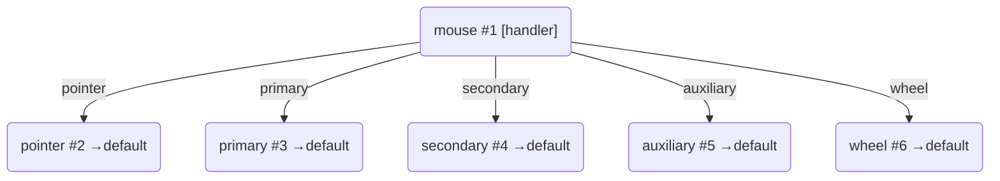
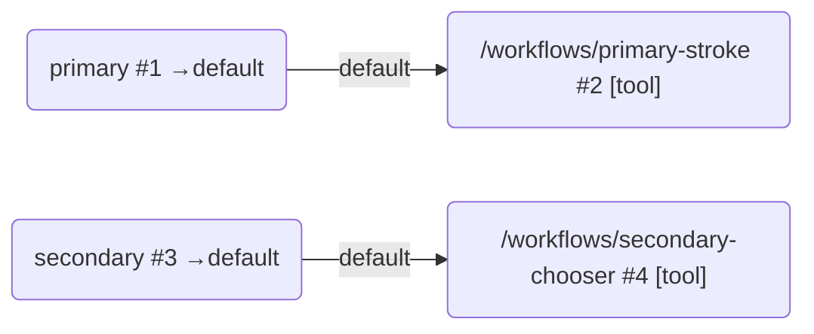

# 鼠标设备

## 概述

鼠标设备负责把宿主层已经确认归属到某个 Viewport 的鼠标输入，翻译成 Core 内稳定的设备信号。

根路径固定为 `/mouse`，整体结构由 `createSubDAG("/mouse")` 构建。

`createMouseDevice()` **不接受任何参数**——设备内部预创建五个通道路由节点（`pointer`、`primary`、`secondary`、`auxiliary`、`wheel`），每个节点统一 `defaultRoute = "default"`。设备不负责信号转换，只负责根据按钮状态把输入信号分流到对应的设备通道。

## 节点结构

### 内部结构

鼠标设备默认创建以下节点：



文本形式：

```
mouse/ (root handler: 更新状态 + 分流)
├── pointer/ ← 所有 position 信号
├── primary/ ← 左键通道（button === 0）
├── secondary/ ← 右键通道（button === 2）
├── auxiliary/ ← 中键通道（button === 1）
└── wheel/ ← 滚轮信号
```

五个通道路由节点均**不带 handler**，统一 `defaultRoute: "default"`。外部 workflow 通过 mount 事件的 edge 直接挂载到通道节点的 `"default"` 边上。

### 外部接入

鼠标设备的通道节点直接连接 workflow，无需边级 prefix。典型的鼠标接入有两个通道：



信号进入通道节点时，`context.value` 已经是世界坐标——坐标转换在根节点中完成。

## 信号语义

鼠标设备接收宿主层传入的信号，`position` 信号的 `context.value` 应为 canvas 相对坐标。

根节点 handler 做三件事：

1. 将 position 信号的 canvas 相对坐标转为世界坐标
2. 更新设备内部状态（按钮掩码、最近位置）
3. 根据按钮状态决定路由目标

坐标转换规则：`worldX = canvasX / viewport.zoom + viewport.origin.x`，`worldY = canvasY / viewport.zoom + viewport.origin.y`。

视口实例来自 `ctx.services.viewport`（由上游 `/<viewportId>` 节点声明）。如果视口不可达，信号原样透传，不发生转换报错。

### 路由规则

根节点接收输入包后，**按信号类型拆分路由**，各通道只收到属于自己的信号列表：

| 信号类型         | 路由目标                                         |
| ---------------- | ------------------------------------------------ |
| `position`       | `pointer` 通道 + 活跃按钮通道                    |
| `wheel`          | `wheel` 通道 + 活跃按钮通道                      |
| `end` / `cancel` | 仅 `context.button` 归属的按钮通道（见下方说明） |
| 其他类型         | 活跃按钮通道                                     |

通道活跃判定：`previousButtons[channel]` 或 `nextButtons[channel]` 为真（按钮在上次处理前或本次处理后处于按下状态）。

**end/cancel 的归属路由**：

- `end` / `cancel` 信号是手势终止事件，只路由到 `context.button`（0 / 1 / 2 → primary / auxiliary / secondary）归属的通道，**不会广播到所有活跃通道**——多键同按时，松开某键的 end 不会提前终结其他仍按住按钮的手势
- 无按钮信息的 end/cancel（`button` 为 -1 或缺失，如 pointerleave / blur）广播到所有活跃通道，保留“终结全部手势”的兑底语义
- 例：按住右键（secondary 框选中）再松开左键，`end(button=0)` 仅路由到 primary 通道，secondary 的框选手势不受影响

**end 信号的合成（不依赖事件源派发）**：

设备以自身按钮状态机的 `buttons` 位掩码 **1→0 跳变**为准合成 end——某些环境（如多键同按时浏览器不逐键派发 pointerup）下事件源可能不产出 end 信号，手势因此永远不结束。只要某个按键松开了，下一个带来新掩码的事件就会触发合成：

- 合成条件：某通道按钮由按下变为未按下，且本包内没有覆盖该通道的显式 end/cancel
- 已被显式 end/cancel 覆盖的通道不重复合成；无归属广播 end 抑制全部合成
- 合成信号形如 `{ type: "end", context: { button, buttons, synthetic: true } }`，按归属路由规则送达对应通道

### 按钮状态推导

按钮状态通过 `buttons` 位掩码推导：

| 位掩码 | 通道      |
| ------ | --------- |
| 1      | primary   |
| 2      | secondary |
| 4      | auxiliary |

`end` 或 `cancel` 信号携带的 `button` 字段（0 / 1 / 2）用于释放对应的按钮通道。

### 显式路径路由

如果输入包的 `to` 字段包含了鼠标设备内部的子路径（如 `/main/mouse/primary`），根节点会额外保留这条显式路径，确保信号也路由到指定通道。

## 设备状态

鼠标设备维护三份状态：

- `activeButtons`：当前各按钮的按下状态快照（`{ primary, secondary, auxiliary }`）
- `lastPosition`：最近一次接收到的位置坐标
- `lastWheelDelta`：最近一次滚轮信号的偏移量（`{ deltaX, deltaY, deltaZ }`）

设备定义通过 `expose()` 暴露：

- `resetState()`：清空内部状态
- `getState()`：返回可序列化快照

## 常量

`DEVICE_DEFAULT_ROUTE` 定义为字符串 `"default"`，是所有设备叶节点的默认路由名。

按钮位掩码定义在设备内部：

```js
const BUTTON_MASKS = {
  primary: 1,
  secondary: 2,
  auxiliary: 4,
};
```

从 `devices/index.js` 统一导出：

```js
import { createMouseDevice, DEVICE_DEFAULT_ROUTE } from "../devices/index.js";
```

## ⚠️ 鼠标坐标参考系

进入鼠标设备的 `position` 信号 `context.value` 应为 **canvas 相对坐标**（即 DOM 坐标减去 `canvas.getBoundingClientRect().left/top`）。

坐标转换在鼠标设备根节点中自动完成，下游通道节点输出的 `context.value` 已是世界坐标。`createCanvasToWorldPrefixHandler` 使用同一套转换逻辑（委托 `viewport.convertCanvasSignalsToWorld`），用于非标准场景下在设备与 workflow 之间插入边级 prefix。详见 [canvas-to-world-handler 文档](../../prefixes/docs/canvas-to-world-handler-document.md)。

## 设计要点

- `createMouseDevice()` 无参数：预创建五个通道路由节点，不依赖外部配置
- 设备根节点在路由前完成坐标转换：canvas 相对坐标 → 世界坐标
- 通道节点输出的信号已是稳定世界坐标，与键盘设备输出 trigger/release 等价
- 所有通道节点 `defaultRoute` 统一为 `"default"`：handler 不写 `to:` 时自动走边
- 多通道汇聚到同一 workflow 时，各通道直接走边，无需额外 prefix

## 相关文档

- [设备定义](./device-document.md)
- [键盘设备](./keyboard-device-document.md)
- [设备图](../../docs/devices-dag-document.md)
- [Core 输入编码](../../../../docs/core-input-encoding.md)
- [canvas-to-world-handler 文档](../../prefixes/docs/canvas-to-world-handler-document.md)
