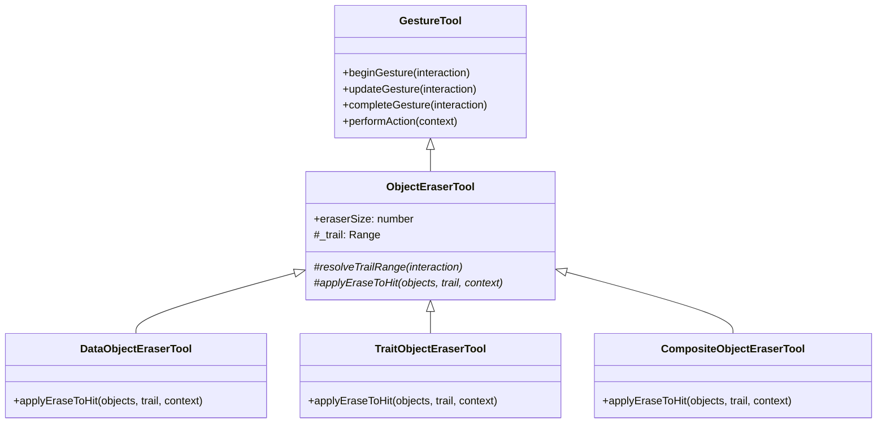

# 对象擦除工具文档

## 概述

对象擦除工具族（也称橡皮工具）负责擦除白板上已有的内容。本文档是设计稿：对象擦除工具族整体未实现，下文描述设计目标与关键决策，对应 `src/core/ui-thread/devices-dag/tools/eraser/` 下的实现。

按擦除语义的作用层面，对象擦除工具分三种：

- **FD（For Data）** — 修改对象的 `data`。例如对笔画，就是从 `data.points` 中移除被擦除的点段。
- **FT（For Trait）** — 给对象附加特征。特征是在该对象的渲染范围内额外渲染的东西，类似 shader。
- **FC（For Composite）** — 橡皮轨迹本身是一个新对象，其 `render()` 将 `ctx.globalCompositeOperation` 设为透出背景的效果。

三种对象擦除工具共享同一套手势交互（落笔 → 拖出轨迹 → 抬笔提交），区别只在命中对象后的处理方式。

## 术语约定

| 术语           | 定义                                                        |
| -------------- | ----------------------------------------------------------- |
| 橡皮轨迹       | 一次手势期间光标经过的路径，携橡皮尺寸，用 Range 表示       |
| 特征（trait）  | 附加在对象上的渲染层，在对象渲染范围内额外渲染，类似 shader |
| 合成擦除笔画   | FC 创建的笔画型对象，渲染时用合成模式透出背景              |
| `isErasable()` | 对象是否支持 FD 擦除的准入标记，只门控 FD，与 FT / FC 无关  |

## 三种对象擦除工具对比

| 方面                   | FD                   | FT               | FC                     |
| ---------------------- | -------------------- | ---------------- | ---------------------- |
| 作用层面               | 对象 `data`          | 对象附加特征     | 渲染层合成             |
| 新建对象               | 可能（一笔擦成两笔） | 不新建           | 新建（橡皮轨迹即对象） |
| 删除对象               | 可能（整笔擦没）     | 不删除           | 不删除                 |
| 受 `isErasable()` 门控 | 是                   | 否               | 否                     |
| 对象数据是否改变       | 是                   | 否（只增特征）   | 否                     |
| 命中测试是否跟随       | 跟随（数据真的变少） | 跟随（咨询特征） | 不跟随（固有语义）     |
| 撤销粒度               | 一次擦除手势         | 一条特征         | 一笔合成擦除笔画       |

## 继承关系



`ObjectEraserTool` 承担公共职责：

- 手势期间把 `position` 流累积为橡皮轨迹 Range（候选：`RopeRange` / `PathRange`）
- 通过 `collectUiOverlayEntries()` 声明橡皮光标与轨迹预览 overlay

命中查询不归公共层：FD 经专用 RPC 委托 Core 完成（见下文），FC 不做命中查询，FT 待特征系统确定。子类只实现命中后的处理 hook `applyEraseToHit()`。

## FD 对象擦除工具（For Data）

### 门控

只有 `isErasable()` 返回 `true` 的对象参与 FD 擦除。当前对象族中：

- `StrokeObject` — `true`
- `GraphObject` / `Container` — `false`

`isErasable()` 只表达"对象是否支持通过修改 `data` 来擦除"，不限制 FT / FC。

### 处理流程

擦除计算在 Core 侧完成，由专用 FD 擦除 RPC 触发（暂记 `boardApi.eraseData(range)`，签名在实现时确定）：

1. UI 线程在手势期间累积轨迹，按手势增量分段发送，fire-and-forget；单段 payload 小，可走 `BoardApiRpc` 的批量合并
2. Core 在合并视图上命中查询，只处理 `isErasable()` 为 `true` 的对象
3. Core 按轨迹切割命中对象的 `data`——对笔画即切割 `data.points`；切割算法以多态方法挂在对象类上，与 rich 几何同处 Core 侧
4. 切割结果分三种：整笔擦没则删除对象；剩单段则回写原对象；剩多段则首段保留原 id 回写，其余段新建对象并继承原 `property` 与 `transform`
5. 一次手势的全部修改 / 新建 / 删除记为一次分子操作，撤销粒度是一次完整擦除手势（分子操作模型见操作文档）
6. Core 侧 mutation 后自动 `requestActiveRender` + flush，视觉反馈与拖拽同一回环

### 为什么在 Core 侧擦除

- **单次触发**：一段轨迹一次 fire-and-forget 调用即完成命中与修改，拖动中实时擦除不等待往返
- **几何就地可用**：切割需要的 `worldPathRange` 等 rich 数据就在 Core 侧，`points` 无需跨桥搬运
- **原子修改**：命中、切割、分裂、删除在 Core 内一步完成，不存在过期快照
- **撤销天然成组**：一次手势的全部变更在 Core 内记为一次分子操作
- **职责匹配**：chooser / modifier 把 `ObjectSummary` 取到 UI 是因为 UI 要显示选择框、拖拽对象；FD 只销毁 / 分裂命中对象，UI 不需要持有对象本体

### 语义特征

- 擦除结果直接落在持久化数据上：序列化、命中测试、撤销都自然跟随
- 橡皮尺寸与轨迹平滑度影响切割精度，取值在实现时确定

## FT 对象擦除工具（For Trait）

FT 依赖特征系统；特征系统与 FT 均未实现，本节为设计意向。

### 特征模型

特征是在该对象的渲染范围内额外渲染的东西，类似 shader。擦除特征是其中一种：它记录对象上被擦掉的区域，渲染时把这些区域从对象的绘制中剔除。

对象模型与渲染管线尚无特征挂载点。

### 处理流程

1. 命中查询同 FD
2. 对每个命中对象新增一条擦除特征，记录轨迹在对象局部坐标下的形状
3. 对象 `render()` 时特征参与渲染，被覆盖区域不绘制

### 语义特征

- 不新建对象，只新增特征
- 对象 `data` 不变；擦除区域随对象移动、变换（特征是对象的附属物）
- 不受 `isErasable()` 门控——任何对象都可以附加特征，包括 Graph 与 Container
- 命中测试咨询特征，被擦除区域不参与命中
- 撤销粒度是"移除一条特征"，比 FD 的数据回滚更轻

## FC 对象擦除工具（For Composite）

### 合成擦除笔画

FC 的轨迹本身就是一个新对象：一次手势创建一笔**合成擦除笔画**。它是笔画型对象，区别在于 `render()` 中：

```js
ctx.globalCompositeOperation = "destination-out"; // 透出背景的效果
```

各对象 `render()` 都硬编码 `ctx.globalCompositeOperation = "source-over"`，互不干扰；合成擦除笔画设置自己的合成模式即可，无需改动其他对象。

合成擦除笔画是普通图成员：参与 z-order、脏区收集、序列化与撤销。`destination-out` 把它覆盖的像素清为透明，透出 canvas 下方的 DOM 背景。

### 处理流程

1. 手势期间累积轨迹点
2. 抬笔提交（`performAction`）时经 `boardApi.createObject` 创建合成擦除笔画对象（新对象类型）
3. 不做命中查询——擦除效果完全由渲染层的 z-order 与合成模式决定

### 语义特征

- 会新建对象，因为橡皮轨迹自己就是一笔
- 不修改、不删除任何已有对象；不受 `isErasable()` 门控
- z-order 语义：只擦除渲染顺序在它之下的内容，之后创建的对象画在它上面，不受影响
- 撤销 = 删除这一笔合成擦除笔画，被遮内容原样恢复

## 设计约束

### FD

- 需要对象配合：每种 `isErasable()` 为 `true` 的类型都要实现"按 Range 切割 `data`"；当前对象族中只有 `StrokeObject` 满足准入
- 分裂产生的新 id 分配、撤销树中的组合记录（一次擦除 = 修改 + 新建 + 删除）需要与 `hit/undo-tree` 对齐

### FT

- 特征的序列化、命中测试咨询、`render` 挂载点都是开放问题

### FC

- 视觉与数据不一致：被擦除的对象在图里仍然完整，命中测试、选择框、导出都按完整对象处理。这是合成擦除的固有语义
- 分层语义（非限制）：`ViewportRenderer` 的 `#cache` 静态层 + `#output` 输出层结构中，AOM 对象始终叠画在静态内容之上，这是正确语义。对象被选中进入 AOM 时，`ActiveObjectManager.pickup()` 会沿静态图把 z-order 在其之上的下游相交对象一并纳入 AOM，合成擦除笔画随之进入输出层叠画；且 `destination-out` 作用于输出 canvas 上已合成的像素（含缓存拷贝），因此被擦内容不会因选中、拖拽而视觉恢复

## 实现状态

对象擦除工具族整体未实现，本文档描述设计目标。文中引用的既有事实以当前代码为准：

- `StrokeObject.isErasable()` 返回 `true`，`GraphObject` / `Container` 返回 `false`
- `ObjectSummary.data` 携带完整类型专属数据（如 `points`）
- `boardApi` 已提供 `hitTest` / `queryObjects` / `modifyObject` / `createObject` / `deleteObjects`
- 各对象 `render()` 硬编码 `source-over`
- `ViewportRenderer` 采用 `#cache` 静态层 + `#output` 合成的两层结构，AOM 对象叠画在静态内容之上
- `ActiveObjectManager.pickup()` 会把选中对象在静态图下游（z-order 之上）的相交对象一并纳入 AOM
- 分子操作模型见操作文档，当前 `hit/operation.js` 只有骨架定义

## 相关文档

- [工具基类](../../docs/tool-document.md)
- [手势工具基类](../../docs/gesture-tool-document.md)
- [对象修改工具](../../modifier/docs/object-modifier-document.md)
- [笔画对象](../../../../../engine/objects/stroke/stroke-classes-document.md)
- [基础类型文档](../../../../../engine/objects/docs/basic-classes-document.md)
- [视口渲染器](../../../../../engine/renderer/docs/viewport-renderer-document.md)
- [操作文档](../../../../../engine/hit/docs/operation-document.md)
