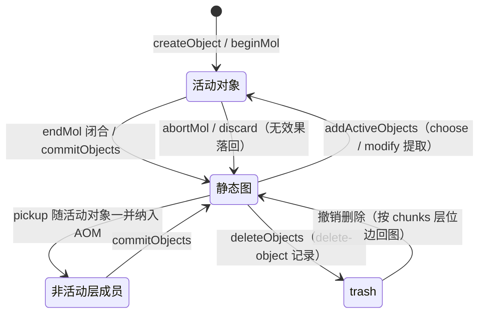
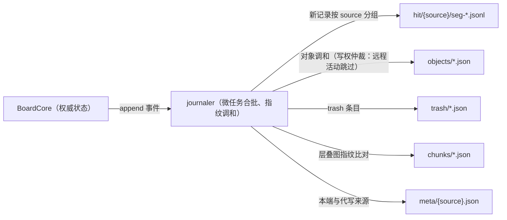

# Core 数据模型与术语统一

本文档整理 `src/kernel/` + `src/ui/` + `src/host/bridges/` 当前实现中的核心数据模型，并明确 UI 线程、Worker 与 Kernel 层之间的权威边界。

## 数据权威划分

### UI 线程

UI 线程持有：

- `Board`
- `DevicesDAG`
- `signalsEventBus`
- `Viewport`
- tools / prefixes / devices
- 工具链中的轻量对象条目（creator `_entry`、chooser / modifier 条目）

这些对象主要服务于输入编排、局部交互和 UI overlay，不是最终对象与区块权威。

### Worker 线程

Worker 线程持有真正的 Core 数据权威：

- `BoardCore`
- `ViewportCore`
- `ActiveObjectManager`
- `Chunk` / `ChunkLoader` / `ChunkObjectManager`
- Worker 侧 base/live 渲染器
- `UndoTree`

### Shared 纯模型层

UI 与 Worker 共用：

- `kernel/objects/`
- `kernel/range/`
- `renderers/canvas/`
- `kernel/types/`
- `kernel/utils/`

## 白板级模型

### `Board`

`Board` 是 UI 侧白板 facade，负责：

- 持有唯一 `DevicesDAG`
- 持有 `signalsEventBus`
- 管理 `viewports`
- 通过 `BoardApiRpc` 与 Worker 通信
- 通过本地 `IncrementalIdPool` 分配来源命名空间字符串 `objectId`

### `BoardCore`

`BoardCore` 是 Worker 侧真实白板状态，关键字段包括：

- `width` / `height`
- `rootPath`
- `undoTree`
- `operationLog`
- `hitCommitter`
- `trash`
- `activityEventBus`
- `chunkLoaded`
- `objectLoaded`
- `chunkLoadEventBus`
- `rootChunkLoader`
- `persistenceAdapter`
- `aomRenderHooks`
- `activeObjectManager`
- `#objectCoverChunks`
- `#objectIdCounters`

在当前实现里，真正的对象、区块与提交关系都以 Worker 中的 `BoardCore` 为准。

## objectId 模型

对象 id 是携带来源命名空间的字符串（如 `demo/1`），由 `IncrementalIdPool`（包装 `CounterPool`）分配。当前 `objectId` 分配规则：

1. UI 工具通过 `Board.allocateObjectId()` 申请 id
2. `Board` 使用本地 `IncrementalIdPool` 递增分配字符串 id，并经 `reportObjectIdCounter` 上报计数
3. `BoardApiRpc.createObject(type, { id, ... })` 把显式 id 发往 Worker
4. Worker 校验重复 id 后创建对象并加入 AOM；已上报的 id 池计数随会话元数据持久化，重开时续种防碰撞

这意味着：

- UI 线程是 **id 分配者**
- Worker 线程是 **id 校验者与使用者**
- `BoardCore.allocateObjectId(source)` 负责 Core 内部创建对象（如数据擦除分裂）的 id 分配；`BoardApi.addObject` 在持板侧串行完成分配与提交，供非本地前端（CLI / daemon 客户端）使用

## 区块级模型

### `Chunk`

单个区块的运行时实体，包含：

- 区块二维坐标与区块 id
- `objectManager: ChunkObjectManager`
- 加载状态与邻接关系

### `ChunkObjectManager`

区块对象管理器，负责：

- `staticGraph`：区块内静态层叠图
- 覆盖区块索引的同步与序列化
- 区块元数据的加载 / 保存

当前覆盖区块索引的权威副本集中在 `BoardCore.#objectCoverChunks`。`ChunkObjectManager` 有 `board` 时会委托给 `BoardCore`，只有无 `board` 的局部测试场景才回退到本地存储。

### `chunkLoaded`

`BoardCore.chunkLoaded` 的值结构可概括为：

```js
Map<chunkId, {
  chunk,
  tempLoadedCount,
  fullLoadedCount,
  loaderStrategy,
}>
```

它表示区块当前被哪些加载器以何种策略持有，而不是对象几何本身。

## 对象级模型

### 真实对象实例

真实对象实例定义在 `kernel/objects/`，基类是 `BasicObject`，再派生出笔画、容器、一维/二维图形等对象类型。

统一字段主要包括：

- `id`
- `position`
- `transform`
- `property`
- `data`
- `rich`

### 轻量对象条目（`LightweightObjectEntry`）

`LightweightObjectEntry` 定义在 `src/kernel/types/types.js`。

它是 UI 工具链里传递对象信息的统一纯数据协议：

```js
{
  id: string,
  type: string,
  position: Vector | { x, y },
  transform?: TransformMatrix2D,
  boundingBox?: RectangleRange,
  range?: Range,
  property: Record<string, any>,
  data: Record<string, any>,
}
```

当前主要有两类场景：

| 场景   | 来源                                     | 特征                                                           |
| ------ | ---------------------------------------- | -------------------------------------------------------------- |
| 创建态 | creator `_entry`                         | `position` 往往是 `Vector`，通常还没有 `range` / `boundingBox` |
| 摘要态 | `queryObjects()` / `hitTest()` / handoff | `position` 是纯对象快照，并附带 `range` / `boundingBox`        |

消费端通常通过 `Vector.parse()` 之类的逻辑统一处理两种 `position` 形态。

### `ObjectSummary`

跨线程查询返回的对象摘要同样定义在 `kernel/types/types.js`，通常包含：

- `id`
- `type`
- `isActive`
- `choice`（所属命名选择名；匿名选择或无选择时缺省）
- `position`
- `transform`
- `boundingBox`
- `range`
- `property`
- `data`

## 动态图与静态图

### 静态图

- 分布在各 `ChunkObjectManager.staticGraph`
- 描述已提交对象的稳定层叠关系
- `commitObjects()` 最终会把活动对象写回这部分结构

### 动态图（AOM）

- 由 `ActiveObjectManager` 管理
- 描述创建、选择、修改等交互态对象与临时层关系
- AOM 内对象由 Worker 侧 `ViewportRenderer` 的输出层负责绘制（AOM 中存在的对象不会回退到静态缓存）

AOM 内部关键结构包括：

- `activeObjects`
- `activeObjectIndex`
- `inactiveGraph`（三态模型的非活动层成员：被 pickup 一并纳入 AOM 的层成员，仍在 AOM 中）
- `layerOrder`
- `layerIndex`
- `onLayer`
- `#localChoices` / `#remoteChoices`（命名选择注册表，本地与远端分表）
- `baseObjectSnapshotWorldRanges`
- `baseObjectSnapshotCoverChunks`

命名选择（choice）跨端以 `"{source}/{choice}"` 形式的引用区分同名 choice（不同来源可同时选择同一对象），choice 名因此禁止含 `/`。

## 分子与超分子

分子（mol）是手势高频写的记录单位：一次交互经 `beginMol(objectIds)` 开口，中间帧经 `amendMol(molId, patchesByObject)` 累积增量，`endMol(molId)` 闭合落一条效果记录，`abortMol(molId)` 丢弃。操作记录共八类分子操作，外加闭合超分子记录 `close-supra`（见 [operation-document.md](../kernel/hit/docs/operation-document.md)）。

超分子（supra）以 `supraId` 把同会话的分子记录即时归组：`beginSupra(key)` / `endSupra(key)` 对应工具层一次完整工作流，`endSupra` 在成员不少于 2 条时追加 `close-supra` 记录，时间回溯树据此把连续成员段折叠为聚合节点（撤销/重做的粒度单位）。`discard` 型分子用于取消选择这类无白板效果的会话。

对象操作记录携带提交/提取时刻的层位边效果（`below` / `above`），回放与远端直接应用记录边而不做几何重算；`delete-object` 记录的 `chunks` 层位边使跨会话撤销删除能按原层位关系回图。

### 对象生命周期



活动与非活动对象都在 AOM 中（`aom.has(id) === true`），分子会话的 begin/amend/end/abort 驱动各态之间的迁移；trash 条目删除时刻的层位边是回图依据。

## 视口与渲染模型

### UI 侧 `Viewport`

`Viewport` 持有：

- `origin`
- `zoom`
- `width` / `height`
- DOM `canvas`
- `uiCanvas`
- `UiRenderer`

它负责屏幕坐标与世界坐标换算、workflow 挂载代理，以及把 Worker 帧绘制到页面。

### Worker 侧 `ViewportCore`

`ViewportCore` 持有：

- `origin`
- `zoom`
- `width` / `height`
- `chunkLoader`
- `renderer`
- `#frameDirty`
- `#frameId`

它负责：

- 视口区块缓冲管理
- `ViewportRenderer` 的缓存 / 输出失效与 flush
- 输出 `render-frame`，当前帧数据核心是 `liveBitmap`

## 持久化模型

当前持久化需要分“代码中的协议”与“默认运行时接线”理解。

### 已有协议

- `BoardCore` 通过 `persistenceAdapter` 暴露 `loadChunkMetadata` / `saveChunkMetadata` / `loadObjects` / `saveObjects` / `deleteObject`（契约与默认实现位于 `kernel/board/persistence-adapter.js`）
- 会话存储布局与恢复语义位于 `kernel/store/`（详见 [file-structure.md](./file-structure.md)）
- 文件操作实现位于 `io/` 包（driver / adapter）

### 默认运行时现状

- demo 以 `~/hound-whiteboard/demo-board` 为板目录运行于持久化模式（Tauri 可用时；浏览器 web demo 无文件系统能力，降级内存模式）
- 落盘主结构是：
  - `chunks/{chunkId}.json`：`{ tierGraph, objectCoverIndex }`
  - `objects/{objectId}.json`：扁平对象文件（id 经百分号编码）
  - `trash/{objectId}.json`：trash 条目（含层位边）
  - `hit/{source}/seg-{NNNNNN}.jsonl`：per-source 操作日志流
  - `meta/{source}.json`：per-source 元数据分片（计数与时间水位）
  - `board.json`：板元数据

### digest 与自愈

协作端周期交换 digest（`{logSize, head, objects, chainHash, stateHash, fullResidency, openMols}`）做对账：`logSize` / `head` 比对日志水位，`openMols` 对账未闭合分子，`chainHash` 是活动链的确定性校验和（驻留无关），`stateHash` 是已驻留对象状态的确定性校验和（仅两端全量驻留时可比）。`chainHash` 分歧时请求全量重建；`stateHash` 分歧时经 `repairStateFromLog` 自愈——从本端日志重放派生对象状态并对齐活体（效果层修复，不改写日志）。

落盘权威属于持板方：每块板由一个持板 daemon 独占落盘（进程内 BoardCore + 日志跟随者）；GUI 打开有 daemon 的板时只读挂载、零写盘，经协作通道与 daemon 双向同步。无 daemon 的单机场景由 Worker 内装配的日志跟随者直接落盘。



### 当前不要过度假设的语义

以下内容不应再写成“已经由代码保证的稳定事实”：

- 每个对象 JSON 一定包含 `ownerChunkId`
- 对象一定按 `objects/chunk{chunkId}/{objectId}.json` 组织

这些更接近设计目标或局部桥接语义，而不是当前所有运行时场景下的统一现实。

相对地，以下已是代码保证的稳定事实：

- `delete-object` 记录必须携带 `chunks` 层位边（删除时刻各区块的 `below` / `above` 前驱后继）
- `trash/{objectId}.json` 条目含同样的 `chunks` 层位边，跨会话撤销删除据此按原层位回图

## 关键术语

- **SignalPacket**：输入系统中的标准信号包，形如 `{ to, signals }`
- **LightweightObjectEntry**：UI 工具链共享的轻量对象协议
- **静态图**：区块级稳定层叠图
- **动态图 / AOM**：交互态对象与动态层关系
- **ObjectSummary**：跨线程查询返回的对象摘要
- **render hook**：BoardCore / AOM 到 ViewportCore 渲染失效的桥接协议
- **分子（mol）**：手势高频写的记录单位，`beginMol` / `amendMol` / `endMol` / `abortMol` 驱动
- **超分子（supra）**：以 `supraId` 归组同会话分子记录，`close-supra` 触发树级折叠
- **层位边**：对象操作记录与 trash 条目携带的 `below` / `above` 前驱后继，回图与回放的层位依据
- **choice（命名选择）**：活动对象的命名分组，跨端以 `"{source}/{choice}"` 区分同名 choice
- **digest**：协作对账摘要 `{logSize, head, objects, chainHash, stateHash, fullResidency, openMols}`，chainHash 分歧请求全量重建，stateHash 分歧经 `repairStateFromLog` 自愈

## 相关文档

- [core-overview.md](./core-overview.md)
- [core-runtime-boundaries.md](./core-runtime-boundaries.md)
- [file-structure.md](./file-structure.md)
- [board-document.md](../ui/components/orchestration/docs/board-document.md)
- [active-object-manager-document.md](../kernel/board/docs/active-object-manager-document.md)
