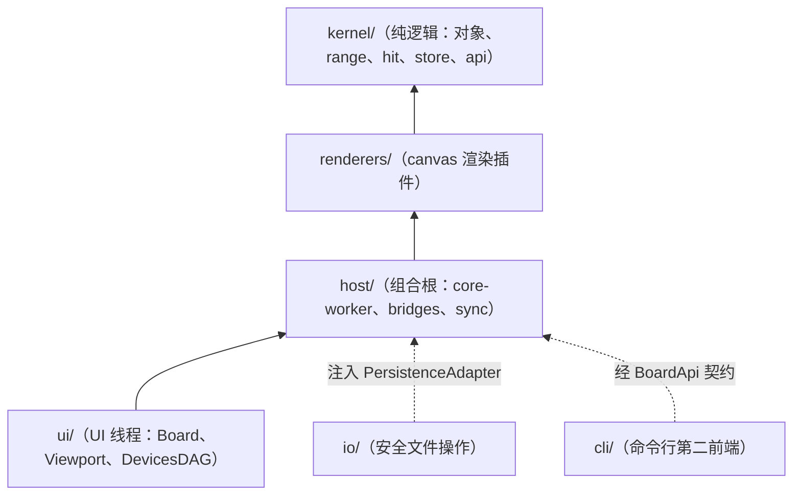

# Core 模块详解

本文档按 `src/kernel/` + `src/ui/` + `src/host/` + `src/io/` 当前目录结构总结各模块职责与协作关系。

更细的线程边界见 [core-runtime-boundaries.md](./core-runtime-boundaries.md)。

## 顶层目录

| 目录            | 主要职责                | 说明                                                                  |
| --------------- | ----------------------- | --------------------------------------------------------------------- |
| `kernel/`       | 内核层（零 canvas/DOM） | 对象模型、range、BoardCore、chunk、AOM、hit、api、store               |
| `renderers/`    | 渲染插件                | canvas 渲染器、绘制策略注册表                                         |
| `host/`         | 组合根与通道            | core-worker、bridges（RPC、IO 转发）、sync（协作同步）              |
| `io/`           | 安全文件操作            | 路径 DSL 与权限策略、driver 三实现、PersistenceAdapter 实现、对外 api |
| `cli/`          | 命令行第二前端          | 写命令经持板 daemon 的 WebSocket RPC 执行，读命令可直读板文件         |
| `ui/`           | UI 线程运行时           | Board、Viewport、DevicesDAG、UiRenderer                               |
| `demo/`         | 白板 HTML/CSS/JS 入口   | 桌面与 web 两种模式的演示宿主（输入绑定、工具装配、workflow 挂载）    |
| `benchmarks/`   | 性能基准                | I/O 桥接、队列、Worker 渲染与 RPC 等基准（`yarn bench`）              |
| `test-support/` | 测试支撑                | canvas mock、worker-mode fixture、AOM fixture                         |
| `tests/`        | 跨模块冒烟测试          | Board 输入流、Worker smoke、共享模块 smoke                            |
| `docs/`         | 架构总览文档            | 当前这组顶层说明文档                                                  |

## 模块分层

依赖方向自下而上：`kernel/` 零 canvas/DOM，被各层复用；`renderers/` 与 `host/` 依次构建其上；`ui/` 经 `host/bridges/` 的 RPC 触达 Worker 权威。`io/` 与 `cli/` 不参与分层主干，作为旁挂包在 host 组合根处接线（io 注入持久化缝，cli 复用 BoardApi 契约面）。

## `ui/`

`ui/` 承载主线程侧的输入、视口和 overlay。

### `ui/components/orchestration/`

| 文件                    | 职责                                                                                            |
| ----------------------- | ----------------------------------------------------------------------------------------------- |
| `board.js`              | UI 侧白板 facade，持有 `DevicesDAG`、`signalsEventBus`、`Viewport` 集合，并负责启用 Worker mode |
| `viewport.js`           | UI 侧视口 facade，负责 DOM canvas、坐标换算、Worker 同步与 workflow 挂载代理                    |
| `board-render-hooks.js` | UI 侧 render hook 工厂，适用于本地/非 Worker 场景的渲染桥接辅助                                 |

### `ui/components/renderer/`

- `ui-renderer.js`：UI overlay 渲染器
- `ui-overlay-factory.js`：UI overlay 条目工厂
- `awareness-overlay.js`：协作感知装饰层（远程命名选择按来源着色框与来源标签、远程光标、远程手势中间帧预览，只画不存）

### `ui/devices-dag/`

这是当前输入系统的主体目录，全部运行在 UI 线程。

#### 根目录

- `dag-type.js`：公共类型定义（typedef 与核心类别名）
- `index.js`：统一 re-export 入口

#### `dag-core/`（引擎）

- `dag.js`：`DevicesDAG` 核心实现
- `dag-builder.js`：`createSubDAG()` DSL
- `dag-node-edge.js`：节点与边定义
- `dag-utils.js`：handler result 规整、类型判断
- `signal.js`：`SignalPacket` 抽象
- `signal-types.js`：稳定信号类型常量（`SIGNAL_TYPES`）
- `dag-debug.js`：DAG 调试输出

#### `devices/`

设备被建模为 `SubDAGDefinition`：

- `mouse-device.js`
- `keyboard-device.js`
- `touchscreen-device.js`

设备负责把宿主输入转换为稳定设备信号，不直接修改白板对象。

#### `prefixes/`

修饰节点（边级转换、信号观测、复制分发等局部编排）：

- `handler.js` / `repeater-handler.js` / `signal-log-handler.js`
- `edge-prefix.js` / `canvas-to-world-handler.js`

#### `tools/`

叶子消费型处理器：

- `tool.js` / `gesture-tool.js`
- `creator/`：创建工具
- `chooser/`：选择工具
- `modifier/`：修改工具
- `wrapper/`：复合工具（顺序 / 互斥组合，如 handoff、tool-switcher）

## `host/`

`host/` 是组合根与通道层：core-worker 宿主与 bridges 桥接。

### `host/core-worker.js`

- Worker 入口
- `CoreWorkerRuntime` 消息宿主封装
- RPC / `rpc-batch` 分发
- `viewport-change` / `request-render-flush` 处理
- `render-frame` 回传
- 持久化装配：rootPath 有效时注册根目录、恢复会话并挂接日志跟随者
- daemon 探测：开板时读板目录 `.daemon.json` 探测持板 daemon，有活 daemon 直连协作（只读挂载、零写盘），无则请求宿主 spawn 并周期重试
- 中继连接装配：`syncUrl` 存在时经 `network-coordinator` 连接协作中继，失败自动重试

### `host/bridges/`

- `board-api-rpc.js`：UI 侧 RPC 客户端（`rpc` / `rpc-batch` / `rpc-response`）
- `io-invoke-forwarder.js`：worker 内驱动的文件操作转发到主线程 Tauri invoke

### `host/sync/`

- `network-coordinator.js`：BoardApi 的同步宿主薄包装——本地操作经中继广播，远程记录经延迟容忍窗接入 `applyRemoteOperations`；周期 digest（`{logSize, head, objects, stateHash, openMols}`）比对、openMols 对账，stateHash 分歧经 `repairStateFromLog` 自愈
- `relay-server.js`：按板房间组织的 WebSocket 无状态中继（成员管理、消息转发、INIT 定向），不缓存任何记录
- `amend-forwarder.js`：订阅内核分子生命周期 amend 事件，begin/end/abort 即时转发，中间帧节流合批后经协调器 volatile 通道广播
- `start-relay.js`：中继启动入口（`node src/host/sync/start-relay.js [端口]`）

## `io/`

`io/` 是安全文件操作框架（safe-io v4），分层为 core（路径 DSL 与权限策略，纯 JS 零依赖）、driver（IoDriver 契约与 memory / node / tauri 三实现）、adapter（PersistenceAdapter 实现）、api（registerRoot → open → handle）。Tauri 模式下安全判断下沉 Rust 可信执行面（`src-tauri/src/commands/`）。详见 [../io/README.md](../io/README.md)。

## `cli/`

`cli/` 是命令行第二前端：写命令（add/delete/undo/redo/choose/unchoose/modify）一律经持板 daemon 的 WebSocket RPC 执行——与 GUI 调 BoardApi 同一条路，天然并发安全、与 GUI 实时互见；读命令既可经 daemon 查询，也可 `--path` 直读板文件（零写盘，不依赖 daemon 存活）。本机所有权模型为「一个板文件夹一个持板 daemon，CLI/TUI/MCP/GUI 均为其客户端」。详见 [../cli/docs/cli-document.md](../cli/docs/cli-document.md)。

## `kernel/`

`kernel/` 是内核领域层，零 canvas/DOM，可在 Worker、CLI、TUI 等任何运行时中使用。

### `kernel/board/`

| 文件                       | 职责                                                         |
| -------------------------- | ------------------------------------------------------------ |
| `board-core.js`            | Worker 侧白板权威状态，对象、区块、AOM、UndoTree、持久化协调 |
| `active-object-manager.js` | 动态图与活动对象生命周期                                     |
| `aom-render-hooks.js`      | 渲染 hook 协议（kernel 调渲染的注入缝）与默认空实现          |
| `persistence-adapter.js`   | 持久化适配器契约与默认无操作实现                             |

### `kernel/chunk/`

- `chunk.js`：区块实体
- `chunk-loader.js`：区块加载器与加载事件
- `chunk-object-manager.js`：静态图与覆盖区块索引管理

### `renderers/canvas/`

- `viewport-core.js`：Worker 侧视口状态、区块缓冲、渲染帧输出
- `renderer.js`：`BaseRenderer` 基类
- `object-draw-strategies.js`：对象类型到 Canvas2D 绘制策略的注册表
- `canvas-lifecycle.js`：Canvas 生命周期管理
- `render-scheduler.js`：渲染调度器
- `dirty-rect-strategy.js` / `dirty-rect-strategy-shared.js`：脏区策略
- `viewport-renderer.js`：Worker 侧视口渲染器
- `aom-collect-utils.js`：AOM 渲染收集辅助

`ViewportRenderer` 建立在 `renderers/canvas/` 的 `BaseRenderer` 基类之上，在单类内管理静态缓存与输出合成。

### `kernel/hit/`

- `operation.js`：八类分子操作 + 闭合超分子记录 `close-supra`（载荷、校验、id 构造、时钟环比较；`close-supra` 触发超分子折叠）
- `operation-log.js`：append-only 操作日志（序号连续与时间单调把关、追加事件订阅、序列化往返）
- `undo-tree-core.js`：时间回溯树（f(日志) 派生、统一撤销三形态与截断、重做栈派生投影、超分子节点）
- `hit-committer.js`：commit 边界单管线（记录构造、时间标记、指定式超分子与简并）

详见 `kernel/hit/docs/` 四篇文档。

### `kernel/api/`

- `board-api.js`：BoardApi 契约面（对象操作、AOM 控制、擦除、撤销/重做、远端应用入口、会话元数据；分子面 `beginMol` / `amendMol` / `endMol` / `abortMol` 与超分子面 `beginSupra` / `endSupra` / `abortSupra`；digest 面 `queryOpenMols` / `queryMolAmendSince` / `queryStateHash` / `repairStateFromLog`）
- `board-api-routes.js`：RPC 路由表（方法名到契约面方法的分发与 flush 策略）

### `kernel/store/`

- `session-store.js`：会话存储布局（board.json / objects / trash / chunks / hit 日志段）与 SessionDriver 注入缝
- `journaler.js`：日志跟随者（append 事件驱动、微任务合批、指纹调和落盘）

详见 [../kernel/store/docs/store-document.md](../kernel/store/docs/store-document.md)。

### `kernel/objects/`

- `basic-obj.js`：基础对象模型
- `stroke/`、`one-dim/`、`two-dim/`、`graph/`、`container.js`
- `object-deserializer.js`

### `kernel/range/`

- `range.js`、`rectangle.js`、`ellipse.js`、`polygon.js`、`path.js`、`rope.js`
- `bounds.js`、`geometry.js`、`intersections.js`、`conversion.js`、`segment-math.js`

### `kernel/types/`

- `types.js`（含 `ViewportLike` 等共享 typedef）
- `board-api-types.js`
- `message-types.js`

### `kernel/utils/`

- `math.js`、`math3d.js`、`math-algorithm.js`
- `directed-graph.js`、`path.js`、`chain.js`
- `event-bus.js`、`deque.js`、`queue.js`
- `counter-pool.js`、`incremental-id-pool.js`（来源命名空间字符串 id 分配）、`random.js`
- `hash.js`（FNV-1a 字符串哈希，状态摘要比对用）、`shared-state-store.js`（跨信道共享状态存储）
