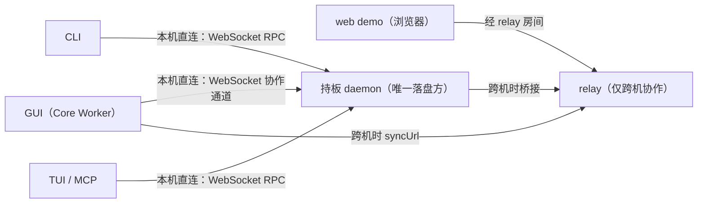
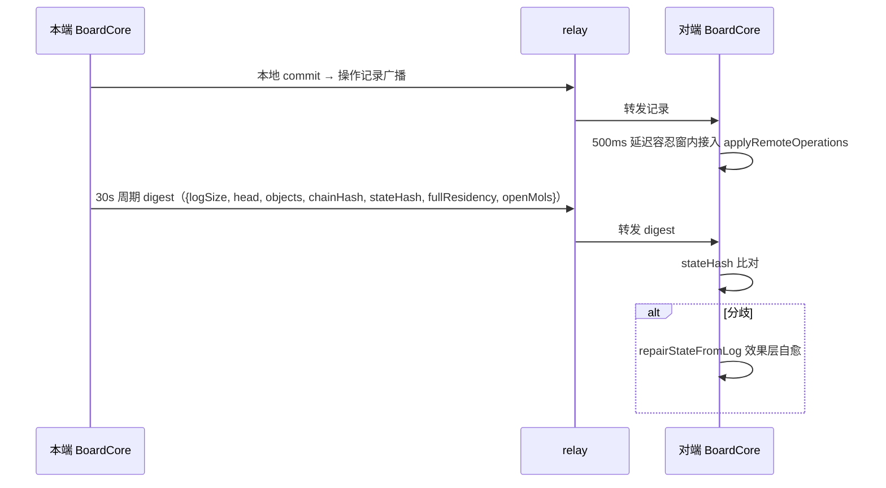

# HoundWhiteboard Core 总览

本文档提供 `src/kernel/` + `src/ui/` + `src/host/bridges/` 当前实现的总览，重点说明 UI 线程、Worker 线程与 engine 核心层如何协作。

更细的路径级边界见 [core-runtime-boundaries.md](./core-runtime-boundaries.md)。

## 运行时分层

当前 Core 可以按职责分为四层：

1. **宿主层**：Tauri（Rust 可信执行面：safe-io commands）/ 模板页面 / DOM 事件绑定
2. **UI 线程层**：`src/ui/**`
3. **Worker 层**：`src/host/**` + `src/renderers/**`
4. **Kernel 层**：`src/kernel/**`

其中 `src/kernel/` + `src/ui/` + `src/host/bridges/` 主要覆盖后 3 层。

四层之外有两个独立包：`src/io/`（安全文件操作，core / driver / adapter / api 分层，经 PersistenceAdapter 缝注入组合根）与 `src/cli/`（命令行第二前端，独立 Node 进程，写命令经持板 daemon 的 WebSocket RPC 执行）。

### 四端一板部署全景

本机各端（GUI / CLI / TUI / MCP）都直连持板 daemon，不经过 relay；relay 只承载跨机协作。

### UI 线程层

UI 线程负责：

- `Board`：白板级 facade，持有 `DevicesDAG`、`signalsEventBus`、`Viewport` 集合
- `Viewport`：DOM canvas、overlay、坐标换算、Worker 同步
- `devices-dag/`：设备子图、prefix、tool 与输入路由
- `UiRenderer`：UI overlay 渲染
- `AwarenessOverlay`：协作感知装饰层（远程选择按来源着色框与来源标签、远程光标、远程手势中间帧预览）
- `BoardApiRpc`：把 UI 侧读写请求转成 Worker RPC

### Worker 层

Worker 层负责真正的数据与渲染权威：

- `CoreWorkerRuntime`：`src/host/core-worker.js` 中的消息入口与 RPC 调度器
- `BoardCore`：对象、区块、AOM、时间回溯树、持久化协调
- `ViewportCore`：Worker 视口状态、区块缓冲、`ViewportRenderer` 渲染输出
- `ActiveObjectManager`：交互态对象与动态层关系
- `kernel/chunk/`：区块、加载器、区块对象管理
- `kernel/hit/`：操作日志与时间回溯树（撤销/重做权威）
- `kernel/store/`：会话存储（日志跟随者增量落盘与会话恢复）
- `renderers/canvas/`：`ViewportRenderer` 与 Worker 侧脏区绘制
- `host/sync/`：协作同步（`network-coordinator` 协调器、`relay-server` 无状态中继、`amend-forwarder` amend 转发）；周期 digest（`{logSize, head, objects, chainHash, stateHash, fullResidency, openMols}`）与 openMols 对账，chainHash 分歧请求全量重建，stateHash 分歧（仅两端全量驻留时可比）经 `repairStateFromLog` 效果层自愈

### Kernel 层

Kernel 不依赖 DOM，也不依赖 Worker 宿主：

- `kernel/objects/`：对象模型、反序列化
- `kernel/range/`：几何范围与相交判断
- `renderers/canvas/`：渲染器基类、调度器
- `kernel/types/`：跨线程共享类型定义
- `kernel/utils/`：数学、图结构、事件总线、路径工具、计数池

## 当前主链路

### 白板初始化

1. 宿主创建 `Worker(new URL("../host/core-worker.js", import.meta.url))`
2. UI 线程创建 `Board`
3. `Board.enableWorkerMode(worker)` 创建 `BoardApiRpc`
4. `BoardApiRpc.createBoard(...)` 在 Worker 中创建 `BoardCore`
5. `Board.createViewport(...)` 创建 UI 侧 `Viewport`
6. `BoardApiRpc.createViewport(...)` 在 Worker 中创建 `ViewportCore`
7. `Viewport.startWorkerSync()` 启动 `viewport-change` 与 `request-render-flush` 循环

`createBoard` 携带有效 `rootPath` 时，Worker 侧先探测板目录 `.daemon.json`（core-worker.js:779）：有活 daemon 则只读挂载、零写盘，经协作通道直连；无则装配 tauri driver 自行落盘并请求宿主 spawn daemon（周期重试探测）。`syncUrl` 存在时装配 `network-coordinator` 连接协作中继（core-worker.js:614-615，失败自动重试，不阻塞开板）。web demo（浏览器无 Tauri）无文件系统能力，`rootPath` 为空降级内存模式 + relay 同步（whiteboard.js:51-52）。

### demo web 模式

web 模式以 `yarn relay`（启动 WebSocket 中继）+ `yarn demo:web`（静态托管 demo 页）运行：浏览器双开 demo 页即两个协作端，经 relay 房间交换操作记录与 amend / awareness 消息；板落盘由连同一房间的持板 daemon 承担（无 daemon 则各端仅存内存）。

### 输入与工具

1. 宿主先判断输入属于哪个 viewport，并编码成 `SignalPacket`
2. 宿主调用 `board.signalsEventBus.emit("input", { to, signals })`
3. `Board` 按 `to` 中的 `viewportId` 把包送进唯一的 `Board.devicesDAG`
4. `DevicesDAG` 从 `/${viewportId}` 子树继续路由
5. 设备节点负责把宿主输入规整成稳定设备信号
6. prefix 节点负责注入参数、边级转换与局部路由；wrapper 节点内部完成顺序/互斥组合（handoff、tool-switcher）
7. tool 叶子消费最终信号，并通过 `boardApi` 或 `viewport` 修改状态

### 渲染

1. tool 通过 `BoardApiRpc` 调用 RPC（手势高频写主路径为 `beginMol` / `amendMol` / `endMol`，`beginSupra` / `endSupra` 负责会话归组）
2. Worker 侧 `BoardCore` / `ActiveObjectManager` 按操作类型选择性地触发 render hooks：
   - `createObject` / `modifyObject` 不涉及静态图变化，只触发 `requestActiveRender`
   - `commitObjects`（apply 到静态图）才同时触发 `requestStaticRenderForObjects` + `requestActiveRender`
3. `ViewportCore` 失效 `ViewportRenderer`，并在 flush 时输出 `render-frame`
4. UI 侧 `Viewport` 接收 `liveBitmap` 并绘制到显示 canvas
5. `UiRenderer` 在 UI 线程补绘 overlay

## Core 的职责范围

### UI 侧职责

- 输入归属与路由入口
- 设备图挂载与 workflow 编排
- 视口 DOM 生命周期
- overlay 渲染
- 对 Worker API 的异步封装
- 本地 `objectId` 分配（`Board.allocateObjectId()`）

### Worker 侧职责

- 对象与区块的真实权威状态
- 命中查询与对象摘要查询
- AOM 动态层与静态图提交
- 视口区块缓冲与位图渲染
- 操作日志与时间回溯树（撤销/重做/远端应用）
- 会话落盘与恢复（日志跟随者）

### Kernel 层职责

- 对象、范围、渲染器基类的纯逻辑复用
- Worker / UI / Node 测试之间共享的数据结构与算法
- JSDoc typedef 与协议约定
- 文档与操作的权威模型（hit）与持久化逻辑（store，文件原理由外部注入）

## 协作同步

本地操作 commit 后经中继广播；对端在 500ms 延迟容忍窗内把远程记录接入 `applyRemoteOperations`（窗内乱序按确定性定序吸收）。每 30s 周期交换 digest 对账，`chainHash`（活动链校验和，驻留无关）分歧时请求全量重建；`stateHash`（已驻留对象口径，仅两端全量驻留时可比）分歧时经 `repairStateFromLog` 从本端日志重放派生状态并对齐活体（效果层修复，不改写日志）。

## 当前实现状态

- Worker mode 是当前主路径
- `Board` / `Viewport` / `BoardApiRpc` / `BoardCore` / `ViewportCore` 已接通
- devices / prefixes / tools 全部停留在 UI 线程
- 高频对象修改通过 `rpc-batch` 做微任务级合并发送
- `hitTest`、`queryObjects`、`queryChunkObjects` 已接到 Worker 权威状态
- `undo` / `redo` 已接通（含侧栏按钮与快捷键）
- 持久化已接通：demo 以 `~/hound-whiteboard/demo-board` 为板目录运行，撤销历史穿越重开
- CLI 前端已接通：写命令经持板 daemon 执行（`src/cli/`），读命令可直读板文件；本机所有权模型为「一个板文件夹一个持板 daemon，CLI/TUI/MCP/GUI 均为其客户端」——GUI 打开板时只读挂载并经协作通道直连 daemon（零写盘），无 daemon 时由宿主 spawn（引用计数 hold/release 管理生命周期）；relay 只承载跨机协作，多 CLI 并发安全（详见 cli-document.md daemon 章节）

## 关键术语

- **SignalPacket**：输入系统里的标准信号包，形如 `{ to, signals }`
- **静态图**：区块内稳定层叠关系，保存在 `ChunkObjectManager.staticGraph`
- **动态图 / AOM**：交互态对象与临时层关系，由 `ActiveObjectManager` 维护
- **LightweightObjectEntry**：UI 工具链里传递的轻量对象协议，定义于 `kernel/types/types.js`
- **render hook**：AOM / BoardCore 通知视口重绘的注入式桥
- **choice（命名选择）**：活动对象的命名分组，跨端以 `"{source}/{choice}"` 区分同名 choice
- **分子 / 超分子**：手势高频写的记录单位（`beginMol` / `amendMol` / `endMol` / `abortMol`）与会话归组单位（`supraId`，`close-supra` 折叠）
- **层位边**：对象操作记录与 trash 条目携带的 `below` / `above` 前驱后继，回图与回放的层位依据
- **digest / 自愈**：协作对账摘要 `{logSize, head, objects, chainHash, stateHash, fullResidency, openMols}`，chainHash 分歧请求全量重建，stateHash 分歧经 `repairStateFromLog` 效果层自愈

## 相关文档

- [core-modules.md](./core-modules.md)
- [core-data-model.md](./core-data-model.md)
- [core-input-flow.md](./core-input-flow.md)
- [core-runtime-boundaries.md](./core-runtime-boundaries.md)
- [core-stable-interfaces.md](./core-stable-interfaces.md)
- [cli-document.md](../cli/docs/cli-document.md)
