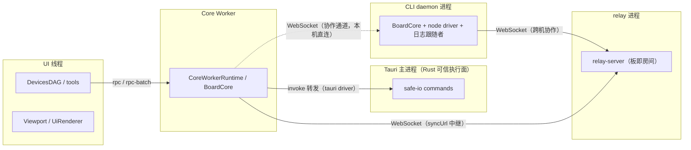

# 运行边界（kernel / ui / renderers / host）

本文档整理 `src/kernel/` + `src/ui/` + `src/host/bridges/` 当前各模块的运行边界。

这里的"运行边界"指的是：

- **UI**：浏览器主线程，可直接接触 DOM、DevicesDAG、宿主输入
- **Worker**：`src/host/core-worker.js` 启动的 Core Worker 线程
- **Kernel**：可在 UI、Worker、Node 测试环境中复用的纯逻辑
- **Host**：Tauri / preload / 主进程等宿主桥接层，不属于 Core 运行时本身，但与之交互
- **CLI / daemon**：独立 Node 进程；daemon 是持板进程（进程内 BoardCore + node driver 落盘 + WebSocket RPC 服务）

## 总览

| 目录 / 文件                                                | 运行边界 | 说明                                                            |
| ---------------------------------------------------------- | -------- | --------------------------------------------------------------- |
| `host/bridges/board-api-rpc.js`                                 | UI       | UI 侧 RPC 客户端，封装 `rpc` / `rpc-batch` / `rpc-response`     |
| `kernel/board/persistence-adapter.js`                           | Kernel   | 持久化适配器契约与默认无操作实现                                |
| `host/bridges/io-invoke-forwarder.js`                           | UI       | worker 内驱动的文件操作转发到主线程 Tauri invoke                |
| `ui/components/orchestration/board.js`              | UI       | UI 白板 facade、唯一 `DevicesDAG`、viewport 管理、Worker 初始化 |
| `ui/components/orchestration/viewport.js`           | UI       | DOM canvas、overlay、Worker 同步、workflow 挂载代理             |
| `ui/components/renderer/ui-renderer.js`             | UI       | UI overlay 渲染                                                 |
| `ui/components/renderer/awareness-overlay.js`       | UI       | 协作感知装饰层（远程选择着色框与来源标签、远程光标、手势预览）   |
| `ui/devices-dag/**`                                 | UI       | 设备图、设备子图、prefix、tool 全部在 UI 线程                   |
| `host/core-worker.js`                                    | Worker   | Worker 入口与 `CoreWorkerRuntime`                               |
| `host/sync/network-coordinator.js` / `amend-forwarder.js` | Worker   | 同步协调器（digest/openMols 对账与自愈）与 amend 转发           |
| `host/sync/relay-server.js` / `start-relay.js`           | Host     | 无状态 WebSocket 中继（板即房间），独立 Node 进程               |
| `kernel/board/board-core.js`                       | Worker   | 对象、区块、AOM、UndoTree、持久化协调                           |
| `renderers/canvas/viewport-core.js`                    | Worker   | Worker 视口状态、区块缓冲、渲染帧输出                           |
| `kernel/board/active-object-manager.js`            | Worker   | 动态图与交互态对象生命周期                                      |
| `kernel/board/aom-render-hooks.js`                 | Worker   | Worker 侧使用的 render hook 协议与默认实现                      |
| `kernel/chunk/**`                                          | Worker   | 区块、加载器、静态图、覆盖区块索引                              |
| `renderers/canvas/**` （Worker 端）                         | Worker   | Worker 侧 base/live 渲染器                                      |
| `kernel/hit/**`                                            | Worker   | UndoTree 与操作结构                                             |
| `kernel/objects/**`                                        | Kernel   | 对象模型与反序列化                                              |
| `kernel/range/**`                                          | Kernel   | 几何范围与碰撞判断                                              |
| `renderers/canvas/**` （基类）                              | Kernel   | 渲染器基类、调度器、共享脏区策略                                |
| `kernel/types/**`                                          | Kernel   | 跨线程共享 typedef 与协议                                       |
| `kernel/utils/**`                                          | Kernel   | 数学、图结构、事件总线、路径、计数池                            |
| `io/**`                                                    | 按 driver 分 | core（路径 DSL 与权限策略）任意环境；tauri driver 在 Worker 内经 invoke 转发到主线程；node driver 在 CLI / daemon 进程；memory driver 任意环境 |
| `cli/**`                                                   | CLI      | 独立 Node 进程；写命令经持板 daemon 的 WebSocket RPC，读命令可直读板文件 |
| `test-support/**`                                          | Any      | 测试 mock 与 fixture                                            |

## `ui/`（UI 线程）

UI 线程承担两类职责：

1. **输入编排**
   - `Board` 持有唯一的 `DevicesDAG`
   - `Viewport` 只做代理挂载入口，不持有自己的第二棵 DAG
   - devices / prefixes / tools 全部运行在主线程
2. **显示与交互表层**
   - `Viewport` 管理 DOM canvas、坐标换算、Worker 消息
   - `UiRenderer` 负责 overlay

UI 线程不会成为对象与区块的真实权威，只保留交互态镜像与轻量条目。

## `kernel/`（Worker 侧）

Worker 是当前 Core 数据与渲染的权威侧：

- `BoardCore` 维护对象、区块、AOM、UndoTree 与持久化协调
- `ViewportCore` 维护视口区块缓冲、base/live renderer 与帧输出
- `ActiveObjectManager` 只在 Worker 中存在
- `renderers/canvas/` 中的 `ViewportRenderer` 只在 Worker 中绘制 `OffscreenCanvas`

Worker 不解析 DOM 事件，也不持有 DevicesDAG。

## `kernel/`（纯逻辑层）

`kernel/` 是稳定的纯逻辑复用层：

- 不依赖 DOM
- 不要求 WorkerGlobalScope
- 可在 Jest / Node 环境直接 import

尤其要注意：

- 共享的渲染基类位于 `renderers/canvas/`（`BaseRenderer`、`RenderScheduler`）
- Worker 专用渲染器也位于 `renderers/canvas/`（`ViewportRenderer`）
- 对象与 range 在 `kernel/objects/` 和 `kernel/range/` 下

## 当前数据权威关系

### 对象与区块

- **Worker 侧 `BoardCore`** 是对象、区块与提交关系的真实权威
- **UI 侧 tools** 通过 `BoardApiRpc` 调用 Worker RPC
- creator `_entry`、chooser / modifier 的轻量对象条目只用于交互，不是最终权威数据源

### 视口与渲染

- **Worker 侧 `ViewportCore`** 负责 base/live 两层真实补绘与 `render-frame` 输出
- **UI 侧 `Viewport`** 负责接收 `liveBitmap` 并绘制到显示 canvas
- **UI 侧 `UiRenderer`** 单独维护 overlay

### objectId 分配

- `Board.allocateObjectId()` 在 UI 侧通过本地 `IncrementalIdPool` 分配来源命名空间字符串 id
- Worker 侧 `createObject` 要求显式传入 `props.id`
- Worker 若收到重复 id，会抛错并通过 RPC 返回错误

## 输入边界

当前输入链路严格停留在 UI 线程：

1. 宿主决定输入归属的 viewport 与设备路径
2. 宿主发出 `board.signalsEventBus.emit("input", { to, signals })`
3. `Board.devicesDAG.dispatch()` 处理后续路由
4. 设备、prefix、tool 全部在 UI 线程消费这条链路
5. 只有真正的数据读写才跨到 Worker

这意味着：

- Worker 不直接接收 DOM 事件
- Worker 不参与设备图路由
- tool 的副作用边界主要是 RPC 与 `Viewport` 方法调用

## 持久化边界

当前持久化边界要分成"协议层"与"默认运行时"两部分理解。

### 已存在的协议层

- `kernel/board/persistence-adapter.js` 定义了 `BoardCore` 依赖的持久化接口
- `kernel/store/session-store.js` 定义了会话存储布局，`kernel/store/journaler.js` 驱动增量落盘
- `rootPath`、`memoryMode()`、`isPersistent()` 等能力已经存在于 `BoardCore`

### 当前默认运行时

- `CoreWorkerRuntime.createBoard()` 在 `rootPath` 有效时装配 tauri driver、会话恢复与日志跟随者
- GUI 开板时探测板目录 `.daemon.json`（core-worker.js:222、:779-801）：有活 daemon 则只读挂载、零写盘，经协作通道直连 daemon；无则请求宿主 spawn 并周期重试
- 持板 daemon 进程内由 node driver 承担落盘（BoardCore + 日志跟随者），GUI / CLI / TUI / MCP 均为其客户端
- demo 以 `~/hound-whiteboard/demo-board` 为板目录运行于持久化模式（Tauri 可用时）
- web demo（浏览器，无 Tauri）无文件系统能力，降级为内存模式 + relay 同步，落盘由持板 daemon 承担（whiteboard.js:51-52）
- 撤销/重做历史随操作日志段落盘，重开后可跨会话撤销

## 当前默认运行模式

当前模板页的默认流程是：

1. UI 线程创建 `Worker(new URL("../host/core-worker.js", import.meta.url))`
2. `Board.enableWorkerMode(worker)` 初始化 `BoardApiRpc` 与 Worker 侧 `BoardCore`
3. `Board.createViewport(...)` 创建 UI 侧 `Viewport`
4. `BoardApiRpc.createViewport(...)` 创建 Worker 侧 `ViewportCore`
5. tools 保持在 UI 线程，通过 RPC 与 Worker 协作

## CLI daemon 进程（第五种运行边界）

持板 daemon 是独立 Node 进程，每块板同时最多一个：

- 进程内装配完整 Core：`BoardCore` + `BoardApi` + node driver + 日志跟随者落盘 + WebSocket RPC 服务
- 本机端（CLI / TUI / MCP / GUI）都是其客户端：写命令一律经 daemon 的 WebSocket RPC 串行执行，与 GUI 实时互见
- daemon 连了中继时，本机端的操作经 daemon 桥接进 relay 房间；relay 只承载跨机协作
- 无 daemon 时 CLI 读命令以 `--path` 自治直读板文件（node driver，零写盘）

## demo web 模式边界

web demo（`yarn demo:web` + `yarn relay`）运行在纯浏览器环境，无 Tauri 宿主层：

- 浏览器主线程承担 UI 边界，Core Worker 仍在 Worker 线程，kernel 边界不变
- 无文件系统能力，`rootPath` 为空降级内存模式；落盘由连同一 relay 房间的持板 daemon 承担
- 同步通道是 relay 的 WebSocket：双端经中继交换操作记录与 amend / awareness 消息

CLI / TUI / MCP 作为独立 Node 进程位于图外，写命令经 WebSocket RPC 进 daemon 泳道。

## 相关文档

- [core-overview.md](./core-overview.md)
- [core-modules.md](./core-modules.md)
