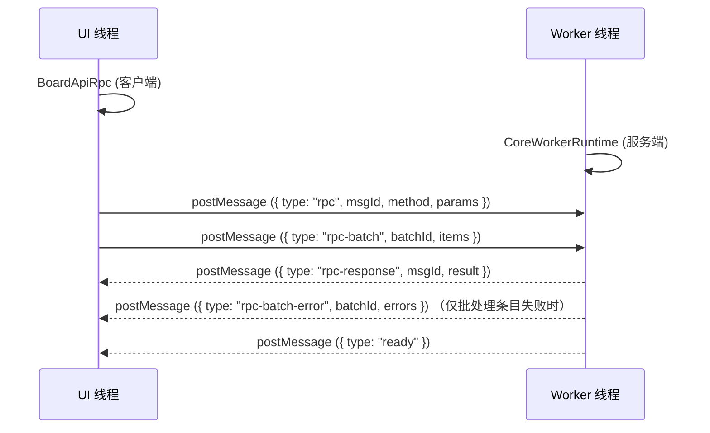

# BoardApiRpc 文档

## 概述

`BoardApiRpc` 是 [BoardApi 契约](../../../kernel/types/board-api-types.js) 的 RPC 运输实现。UI 侧通过它暴露异步方法，经过 JSON-RPC 风格的消息协议与 Worker 侧的 `BoardCore` 交互。

`BoardApiRpc` 不承载业务逻辑，只负责：

- 将 UI 侧操作翻译为 RPC 请求
- 高频写入方法的微任务级批处理合并
- RPC 响应路由与超时管理
- 批处理条目失败回执的分发（`onBatchError`）

契约（`@typedef BoardApi`）定义在 [board-api-types.js](../../../kernel/types/board-api-types.js)，约束所有实现的统一签名。

## 架构

初始化流程：

1. UI 侧创建 Worker 实例
2. `BoardApiRpc` 构造时绑定 Worker 的 `postMessage` / `addEventListener` / `removeEventListener`
3. Worker 启动后发送 `{ type: "ready" }` 消息，`BoardApiRpc` 记录 `isReady()`
4. UI 侧调用 `waitUntilReady()` 等待就绪，然后通过 `createBoard()` 完成板面初始化

### 消息类型

| type              | 方向        | 说明                                        |
| ----------------- | ----------- | ------------------------------------------- |
| `rpc`             | UI → Worker | 带 msgId 的单次远程调用，必有响应           |
| `rpc-batch`       | UI → Worker | 批量 fire-and-forget 消息，携带递增 batchId |
| `rpc-response`    | Worker → UI | RPC 调用结果，包含 result 或 error          |
| `rpc-batch-error` | Worker → UI | 批处理失败条目回执，仅在有条目失败时回传    |
| `ready`           | Worker → UI | Worker 初始化完成通知                       |

### 非 RPC 的 core-worker 通道

以下消息类型同属 core-worker 通道，但不经 `BoardApiRpc` 的 RPC 协议（无 msgId、无响应路由）：

- `awareness-send`（UI → Worker）：awareness 广播请求（光标上报、分子中间帧等 volatile 数据），Worker 经同步协调器的 volatile 通道发出
- `awareness`（Worker → UI）：远程 awareness 到达与断线通知，由 UI 侧 `addAwarenessListener` 订阅者消费（只画不存）
- `worker-log`（Worker → UI）：Worker 侧日志转发，由 UI 侧日志总线接收

这些通道与 RPC 并行存在，互不经过对方的封装。

## API 面

所有方法返回 `Promise`。参数格式见 [board-api-types.js](../../../kernel/types/board-api-types.js)。

Worker 侧分发由路由表 [board-api-routes.js](../../../kernel/api/board-api-routes.js) 承担。路由表是更全集：`queryStateHash` / `repairStateFromLog` / `queryMolAmendSince` / `applyRemoteOperations` 等方法不经 `BoardApiRpc` 客户端封装，仅经路由分发（CoreWorkerRuntime 与 CLI daemon 复用同表）。

### 板面生命周期

| 方法                   | 说明                                                               |
| ---------------------- | ------------------------------------------------------------------ |
| `createBoard(options)` | 初始化 Worker 侧 `BoardCore`，可选 `width` / `height` / `rootPath` |
| `destroyBoard()`       | 销毁 BoardCore，清理所有 ViewportCore                              |

### 视口管理

| 方法                          | 说明                                                                            |
| ----------------------------- | ------------------------------------------------------------------------------- |
| `createViewport(options)`     | 创建 Worker 侧 `ViewportCore`，`options` 需含 `viewportId` / `width` / `height` |
| `destroyViewport(viewportId)` | 销毁指定 ViewportCore                                                           |

### 对象创建与提交

| 方法                                | 说明                                                                                                                  |
| ----------------------------------- | --------------------------------------------------------------------------------------------------------------------- |
| `createObject(type, props)`         | 创建对象实例并加入 AOM 动态图。`props` 需含 `id` / `position`。不触发区块加载                                         |
| `commitObjects(objectIds, options)` | 将 AOM 中的对象按动态层关系写入区块静态图。走 `ActiveObjectManager.apply` 路径；`options.supraKey` 可指定进入的超分子 |
| `deleteObjects(objectIds, options)` | 删除对象并移入 trash（可撤销恢复）                                                                                    |
| `eraseData(payload, options)`       | 数据擦除（轨迹段 + 半径）；`options.supraKey` 可指定会话 key 使一次擦除手势凝聚为一个节点                             |

### 对象修改（高频写入）

| 方法                                          | 说明                                                                      |
| --------------------------------------------- | ------------------------------------------------------------------------- |
| `modifyObject(objectId, patch)`               | 修改单个对象的位置 / 变换 / 属性 / 数据。同帧多次调用自动合并为单次批处理 |
| `modifyObjects(patches)`                      | 批量修改多个对象，不经过批处理缓冲，为确认式语义                          |
| `appendListItem(objectId, key, items)`        | 向列表属性追加元素。同帧合并                                              |
| `replaceListItem(objectId, key, index, item)` | 替换列表属性指定索引元素。同帧覆盖                                        |
| `removeListItem(objectId, key, index)`        | 删除列表属性指定索引元素                                                  |

所有高频写入方法（含增量式分子的 `amendMol`）同帧内合并为单条 `rpc-batch` 消息发送，减少 Worker 侧消息处理开销。

### 批处理控制

| 方法                    | 说明                                                                          |
| ----------------------- | ----------------------------------------------------------------------------- |
| `flush()`               | 强制 flush 当前批处理缓冲。resolve 时机为消息已写入传输层，不代表 Core 已应用 |
| `onBatchError(handler)` | 订阅批处理条目失败回执，返回取消订阅函数                                      |

### AOM 控制

| 方法                                        | 说明                                                                                      |
| ------------------------------------------- | ----------------------------------------------------------------------------------------- |
| `addActiveObjects(objectIds, options?)`     | 将对象从静态图检出到 AOM 动态图；`options.supraKey` 指定超分子、`options.choice` 命名选择 |
| `discardActiveObjects(objectIds, options?)` | 将对象从 AOM 丢弃，不修改静态图；`options.supraKey` 指定超分子                            |

### 查询

| 方法                          | 说明                                               |
| ----------------------------- | -------------------------------------------------- |
| `queryObjects(ids)`           | 按 id 查询对象摘要（类型、位置、变换、边界、属性） |
| `queryChunkObjects(chunkIds)` | 按区块 id 查询归属该区块的所有对象 id              |
| `hitTest(range, mode)`        | 执行命中检测，返回与指定范围相交的对象 id 列表     |
| `queryChoices()`              | 列出本端的命名选择（choice）                       |
| `queryRemoteChoices()`        | 列出全部远程命名选择（awareness 查询面）           |

### 撤销 / 重做

| 方法     | 说明                               |
| -------- | ---------------------------------- |
| `undo()` | 撤销（目标节点语义，含截断形态）   |
| `redo()` | 重做（重做栈为派生投影，条件应用） |

### 增量式分子

| 方法                               | 说明                                                                         |
| ---------------------------------- | ---------------------------------------------------------------------------- |
| `beginMol(objectIds, options?)`    | 开启增量式分子（手势 begin，捕获 before 快照），返回分子 id                  |
| `amendMol(molId, patchesByObject)` | 对进行中的分子施加增量修正（手势每帧）。fire-and-forget 批写，同帧同分子合并 |
| `endMol(molId)`                    | 定稿分子（end-amend 物化上链）                                               |
| `abortMol(molId)`                  | 中止分子（丢弃 amend 流，实例还原到手势起点）                                |
| `queryOpenMols()`                  | 查询本端未闭合分子清单（断线重连对账用）                                     |

### 超分子会话

| 方法              | 说明                                                                                            |
| ----------------- | ----------------------------------------------------------------------------------------------- |
| `beginSupra(key)` | 按 key 开启超分子：成员记录即时物化上链（携带 supraId），不缓冲草稿                             |
| `endSupra(key)`   | 先强制闭合在途分子，再追加 close-supra 记录；活动链上同 supraId 连续段（≥2 成员）折叠为聚合节点 |
| `abortSupra(key)` | 丢弃未闭合分子，并逐个撤销已物化成员                                                            |

### 会话元数据

| 方法                                     | 说明                                         |
| ---------------------------------------- | -------------------------------------------- |
| `reportObjectIdCounter(source, counter)` | 上报 UI 侧对象 id 池计数（随板元数据持久化） |
| `getObjectIdCounters()`                  | 读取对象 id 池计数表（重开板后续种）         |

### 调试

| 方法                           | 说明                                            |
| ------------------------------ | ----------------------------------------------- |
| `requestDebug(query, payload)` | 向 Worker 发送 fire-and-forget 调试请求，无响应 |

## 批处理机制

`modifyObject`、`appendListItem`、`replaceListItem`、`removeListItem`、`amendMol` 使用微任务级批处理：

1. 调用时，参数存入 `#batchBuffer`（map key 为 `method:objectId:key:index`；`amendMol` 为 `amendMol:{molId}`）
2. 同 key 的后续调用自动合并（`modifyObject` 的 patch 逐字段合入，`appendListItem` 的 items 合并为数组，`amendMol` 的 patchesByObject 逐对象合并 patch）
3. 在下一个微任务中执行 `#flushBatchNow`，将所有缓冲条目打包为单条 `rpc-batch` 消息发送（携带递增 batchId）
4. 发送前若有非批处理方法调用（如 `createObject`、`endMol`），会自动触发 `#flushBatchNow` 确保时序正确

### 写路径的两层语义

- **fire-and-forget 批写**（`modifyObject` / `appendListItem` / `replaceListItem` / `removeListItem` / `amendMol`）：入队即 resolve，不代表 Core 已应用。Worker 侧单条目失败不影响其余条目执行，失败条目以 `rpc-batch-error` 回传，经 `onBatchError` 订阅者接收；`Board.enableWorkerMode` 默认挂 WARN 级日志订阅
- **确认式写**（`createObject` / `modifyObjects` / `deleteObjects` / `commitObjects` / `eraseData` 等）：走完整 RPC 往返，resolve 即 Core 已处理，返回值与错误可信

选择规约：逐帧高频写（拖动、绘制过程）用批写方法；需要对账或依赖写结果的场景用确认式方法。

## hitTest 的区块加载行为

`hitTest` 与其它只读查询不同：若查询范围覆盖未加载或仅临时加载的区块，会自动执行 FullLoad 后再进行命中检测。

流程：

1. 计算查询范围覆盖的区块 ID 集合
2. 对每个未 FullLoad 的区块，创建临时 ChunkLoader 发射 FullLoad 请求
3. 逐个等待 `LOAD_COMPLETE` 事件（使用 `on+off` 避免 `EventBus.once` 在并发加载时的竞态）
4. FullLoad 完成后 `syncChunkObjectEntries` 确保对象实例已载入 `objectLoaded`
5. 遍历 `boardCore.objectLoaded` 执行范围相交检测
6. 销毁临时 ChunkLoader，释放引用

这意味着：

- 在可视范围内的 hitTest 总是能找到已提交到静态图的对象
- 在从未访问过的区域 hitTest，会触发一次 FullLoad 后命中，后续不再重复加载
- `mode` 参数当前保留未使用，默认行为等同 `"intersect"`

## RPC 超时

- 默认超时 5000ms
- 可在构造时通过 `timeoutMs` 选项覆盖
- 超时后 Promise reject，错误码 `RPC_TIMEOUT`
- 超时不受 `waitUntilReady` 影响（该超时由独立定时器管理）

## 设计约束

- `BoardApiRpc` 不依赖 DOM 或特定 Worker 实现，只要求端点满足 `postMessage` / `addEventListener` / `removeEventListener` 接口
- `createObject` 需要显式传入 `id` 字段（当前由 UI 侧 `Board.allocateObjectId()` 分配）
- 同线程实现（`BoardApiLocal`）已移除，当前仅保留 RPC 实现

## 相关文档

- [board-core-document.md](../../../kernel/board/docs/board-core-document.md)
- [active-object-manager-document.md](../../../kernel/board/docs/active-object-manager-document.md)
- [core-modules.md](../../../docs/core-modules.md)
- [board-api-types.js](../../../kernel/types/board-api-types.js)
