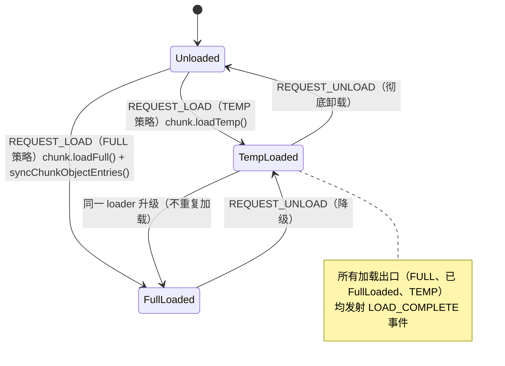

# 白板核心文档

本文档提供 `BoardCore` 的概述。

## 概述

`BoardCore` 是白板在 Worker 线程中的纯数据实现，承载对象注册、区块加载、AOM、UndoTree、操作日志与 hit 提交、持久化协调等职责。不依赖 DOM、DevicesDAG、signalsEventBus。

UI 侧的 `Board` facade 通过 `BoardApiRpc` 与 Worker 侧的 `BoardCore` 通信。测试路径中可创建本地 `BoardCore` 实例。

## 运行边界

| 类             | 线程   | 职责                                           |
| -------------- | ------ | ---------------------------------------------- |
| `BoardCore`    | Worker | 对象与区块管理、AOM、UndoTree、持久化协调      |
| `Board`        | UI     | facade、输入分发、viewport 管理、Worker 初始化 |
| `BoardApiRpc`  | UI     | RPC 客户端，通过 postMessage 与 Worker 侧通信  |
| `ViewportCore` | Worker | 视口状态、chunk buffer、base/live 渲染         |

## 核心字段

| 名称                  | 描述                                                                                    |
| --------------------- | --------------------------------------------------------------------------------------- |
| `width` / `height`    | 区块尺寸（像素），用于 worldToChunkId 计算                                              |
| `rootPath`            | 白板文件根路径，`undefined` 时为内存模式                                                |
| `operationLog`        | 操作日志（hit 数据池），`OperationLog` 实例                                             |
| `undoTree`            | UndoTree 实例                                                                           |
| `hitCommitter`        | hit 提交器，分子操作的 commit 边界单点                                                  |
| `trash`               | 已删除对象的回收站（objectId → 删除时刻的全量序列化与各区块层位边集）                   |
| `activeObjectManager` | AOM 实例，管理活动对象集合与动态层关系                                                  |
| `chunkLoaded`         | `Map<chunkId, BoardChunkLoadedState>`，记录各区块的加载计数与 loader 策略               |
| `objectLoaded`        | `Map<objectId, BoardObjectLoadedState>`，白板级对象实例注册表                           |
| `chunkLoadEventBus`   | 区块加载事件总线（REQUEST_LOAD / REQUEST_UNLOAD / LOAD_COMPLETE）                       |
| `activityEventBus`    | AOM 活动事件总线（ephemeral），本地 choose/unchoose/commit 手势事件即时广播，不经日志   |
| `rootChunkLoader`     | 根区块加载器，负责区块实例的创建、持有、释放                                            |
| `persistenceAdapter`  | 持久化适配器接口，内存模式使用默认实现，文件模式使用 `createRendererPersistenceAdapter` |
| `aomRenderHooks`      | 注入式渲染钩子，替代 AOM 对 viewport/renderer 的直接依赖                                |
| `#objectCoverChunks`  | 集中式对象覆盖区块索引（objectId → Set&lt;chunkId&gt;），全 BoardCore 唯一权威副本      |

## Chunk 加载生命周期

Block core 通过事件总线驱动区块的加载与卸载：



加载策略由 `ChunkLoader` 的 `requesterId` 跟踪。同一 loader 从 TEMP 升级到 FULL 时不会重复加载。

### FULL vs TEMP

| 策略 | 加载内容                                                     | 触发方                                                   |
| ---- | ------------------------------------------------------------ | -------------------------------------------------------- |
| TEMP | 层叠图（tierGraph）+ 覆盖索引（objectCoverIndex）            | `pickup()` 遍历                                          |
| FULL | TEMP 内容 + `syncChunkObjectEntries()`（从磁盘加载对象实例） | `apply()` 提交、`syncChunkBufferWithViewport()` 视口同步 |

## 对象覆盖索引

`objectCoverChunks`（objectId → 覆盖的区块 id 集合）集中在 `BoardCore.#objectCoverChunks` 统一管理。`ChunkObjectManager` 上的同名方法委托到 `BoardCore`。

```javascript
setObjectCoverChunks(objectId, chunkIds); // 写入
getObjectCoverChunks(objectId); // 读取
unsetObjectCoverChunks(objectId); // 删除
```

`ChunkObjectManager` 上的同名方法以可选链委托到 `BoardCore`：无 board 时写入为空操作，读取返回空集合。

## 持久化

`BoardCore` 自身不直接落盘：区块元数据与对象读写经 `persistenceAdapter`（内存模式为空实现，文件模式为 `createRendererPersistenceAdapter`）；会话级落盘与恢复由 store 层承担（见[会话存储内核文档](../../store/docs/store-document.md)、[文件结构文档](../../../docs/file-structure.md)）：

- **分片落盘（布局 v2）**：`journaler`（日志跟随者）订阅操作日志增长，微任务合批后按 `record.source` 分组写 `hit/{source}/seg-{N}.jsonl`；对象文件与区块元数据按当前白板状态指纹调和（序列化比对，仅写差异）；写权仲裁——远程活动对象（AOM `isRemoteActive`）跳过不写不移除，写权属活动方；元数据按 source 分片写 `meta/{source}.json`，`board.json` 创建时写一次后只读。
- **会话恢复**：打开既有板时 `restoreSession({ chunkMetadataList, objects, trash })` 先回填各区块层叠图与覆盖索引（决定对象注册时的加载计数，恢复的区块标记完整加载态），再注册活动对象实例，最后恢复 trash 条目（含层位边，供跨会话撤销删除）。

内存模式下所有操作无副作用。

## 当前状态

- `BoardCore` 作为 Worker 侧真实数据权威运行
- AOM、UndoTree、区块管理完整集成
- Chunk 加载支持 FULL / TEMP 两级策略
- `objectCoverChunks` 集中化管理

## 相关文档

- [board-document.md](../../../ui/components/orchestration/docs/board-document.md)（UI 侧 Board facade）
- [active-object-manager-document.md](./active-object-manager-document.md)
- [viewport-core-document.md](../../../renderers/canvas/docs/viewport-core-document.md)
