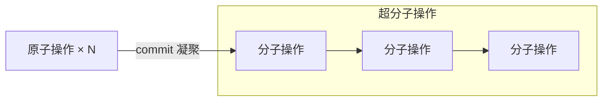

# 操作文档

本文档记录 Undo/Redo 体系中操作模型的设计意图。

> [!WARNING]
>
> 当前 `src/core/engine/hit/operation.js` 仍只有 `AtomOperation` 与 `MolecularOperation` 的骨架定义。本文列出的操作模型应理解为**目标模型**，并非当前已完整实现的运行时能力。

## 操作层级

操作分三级：

- **原子操作** — 采样点级的瞬时微操作，发生在 AOM 动态图中，不产生 hit 节点。
- **分子操作** — hit 节点的携带单位，内核共享树的生长单位。
- **超分子操作** — 多个分子操作的有序组合，撤销与协作的粒度单位。

hit 节点的粒度只有分子操作与超分子操作两种，合称**节点粒度**。

## 原子操作

原子操作多为采样点级别：书写时的采样点追加、拖拽中的帧位移等瞬时变化。原子操作发生在 AOM 动态图中，不进 hit；同一逻辑操作的全部原子操作在 commit 时凝聚为一个分子或超分子操作——单手势操作在手势结束时 commit，多手势操作（多手势的对象创建、修改）在最终提交时 commit。

## 分子操作

分子操作按**作用对象**分为两类：

- **对象级操作**： 改变白板内容或对象的图层归属
- **树级操作**： 改变 hit 自身

分子操作按**对 hit 的作用**分为三类：

- **增加节点类**： 在 HEAD 之后追加节点：增加对象、修改对象、删除对象、选择对象、取消选择对象
- **移动指针类**： 更改 HEAD 指针、重做
- **改挂类**： 撤销：在目标节点的父节点处分叉并改挂后续链；目标为活动链末端时退化为纯 HEAD 回退

分子操作按**作用域**分两组：

- **作用在白板上**：增加、修改、删除、选择、取消选择对象——效果落在白板文档状态上，可被撤消操作抵消。
- **作用在时间回溯树上**：撤销、重做、更改 HEAD 指针——效果落在树的结构与指针上；撤销与重做经树的结构与指针变化抵消或恢复白板操作的效果，白板状态随投影联动。

### 操作无法撤消

日志只增不删，任何操作一经记录永久留在日志中。撤消操作撤消的是目标操作在白板上的效果——效果由新操作抵消，原操作仍在日志中、可溯源。树操作中：撤销的效果由重做抵消，更改 HEAD 指针可再次移动。

节点注解（标记关键点、注释节点）归 UI 层，不进 hit。

### 分子操作的记录

分子操作携带以下信息：

- `id`：操作 id，形如 `"{source}/op-{n}"`，复用 id 命名空间（见[时间回溯树内核文档](undo-tree-kernel-document.md)）。
- `source`：发起者标识，即 hit 节点的 author。
- `properties`：涉及属性的集合（如 `position`、`property`、`data.points`），冲突合并的判定粒度。
- 修改前后快照：undo 用前快照回退，协作用后快照传播；删除的对象移入 `history/trash/`，代替后快照。
- 层栈快照：操作时刻的完整 z-order（增加与修改对象记录），撤销与层位修复的定位依据——快照内成员按相对位置定位，快照外的层按时间序判定上下，后到者居上。
- 时间标记：操作级 CRDT 重建的排序依据。

三个原则：

- **分子操作的边界是提交的效果**：单手势操作（一笔画线、一次 FD 擦除）在手势结束时提交凝聚；多手势操作（多手势的对象创建、对象修改）的中间手势只产生原子操作，最终提交时才凝聚。Core 侧入口已收口（`BoardApi.eraseData`、AOM `apply`），在单点按提交时机包装。
- **不跨端重放操作语义**：同步复制的是效果（快照），各端直接应用快照，免除跨端重放操作语义（如切割几何）的逐字节一致性要求。
- **操作为王**：操作是一等记录（id、author、时间、内容），可产生多个节点；树是日志的追溯结构，节点数据放在数据池中凭 id 获取。移动指针类操作不产生节点，也可入日志。

### 增加对象

向静态图添加某对象。记录区块 id、对象 id、对象全量内容，以及操作时刻的完整层栈快照（z-order），用于撤销与层位修复时恢复层位关系。

### 修改对象

修改某对象的属性、数据或层位关系。记录区块 id、对象 id、涉及属性集合、修改前后快照，以及操作时刻的完整层栈快照。z-order 调整（置顶、置底、上移、下移）视为修改对象，层位变化经层栈快照表达。

### 删除对象

从静态图删除某对象。记录区块 id 与对象 id，对象移入 `history/trash/`。

### 选择对象

将对象选入 AOM。选择改变对象的图层归属，该操作可能进入 hit 内核；更多以超分子操作中的分子呈现，鲜有单独出现。

### 取消选择

将对象移出 AOM（提交回静态图，或放弃更改）。与选择对象配对：选择把对象提升到输出层，取消选择将其交回，图层归属变化是双向的。同样更多以超分子操作中的分子呈现（如拖拽 = 选择 + 修改 + 取消选择）。

### 更改当前 HEAD 指针

HEAD 指向当前状态对应的节点。按「所有用户一致」原则：网络同步良好时，所有用户的 HEAD 指针相同，每个用户的 hit 也相同。因此更改 HEAD 是分子操作，记录在树中并同步到各用户。更改 HEAD 的用途：撤销与重做的指针效果、移动至其它分支。

## 超分子操作

多个分子操作按序合成一个超分子操作，作为整体成为撤销与协作的粒度单位。

例：一次 FD 擦除手势 = 修改对象（回写首段）+ 增加对象（分裂段，可有多个）+ 删除对象（整笔擦没）的顺序组合（见[对象擦除工具文档](../../../ui/devices-dag/tools/eraser/docs/object-eraser-document.md)）。选择对象更多作为超分子操作中的分子出现。

## 撤销与重做

撤销与重做各为一类操作，撤销按目标在活动链上的位置统一呈现两种形态。

### 撤销

撤消操作 D 在白板上的效果，D 缺省为活动链末端节点。撤销本身也记录于日志——操作无法撤消，撤销抵消的是效果，D 本身仍留在日志中、可溯源。撤销记录**目标节点**；HEAD 移动是应用时算出的效果。应用规则：

1. 在 D 的父节点处分叉：把 D 与 HEAD 之间的链（不含 D）改挂到分叉点；原位置按 (时间, author) 截断保留——不晚于撤销操作的节点留下共享数据，晚于的只存在于撤消分支。
2. HEAD 移到新末端。
3. D 是活动链末端时，没有可改挂的节点，效果退化为 HEAD 回退到 D 的父节点。
4. D 不在活动链上（已被撤消）时，撤销无效，被吸收。

离线期间的撤销在合并时按合并树上的目标节点位置应用：目标已被推到链中间时，撤销呈现分叉改挂的一般形态，离线意图被保留（见[时间回溯树内核情景推演](undo-tree-kernel-example.md)情景四）。

### 重做

把 HEAD 移到最近一次生效的撤销所记录的原 HEAD 位置（撤销前的活动链末端）。原 HEAD 位置所在的分支始终留在树上，重做是纯 HEAD 移动，按条件应用。被吸收（未生效）的撤销不产生重做目标；撤销后活动链上已有新操作时，重做是否可用由 UI 策略决定。

## 相关文档

- [时间回溯树 UI 文档](undo-tree-ui-document.md)
- [时间回溯树内核文档](undo-tree-kernel-document.md)
- [对象擦除工具文档](../../../ui/devices-dag/tools/eraser/docs/object-eraser-document.md)
