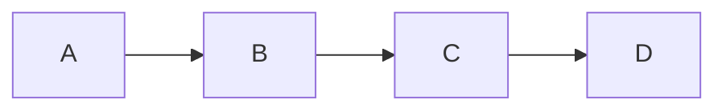

# 全屏窗口文档

本文档提供项目中的全屏窗口的概述。

## 全屏窗口概述

全屏窗口是 Hound Whiteboard 的核心，用户在此绘画、写字、记笔记。

全屏窗口之下，由多个模块组成。以下是各个模块的关联与概述图：

## [Render Manager](render-manager.js) (RM)

用以向 canvas 渲染 Quark 类

### 功能:
- 直接与 canvas 交互

### 主要类:
- `RenderManager` - 渲染管理器类

### 主要方法:
- `RenderManager`
	- `renderQuark(quark)` - 用以渲染 Quark

### 依赖:

## [Reaction Manager](reaction-manager.js) (RaM)

用以翻译用户的输入

### 功能:

### 主要类:

### 主要方法:

### 依赖:
